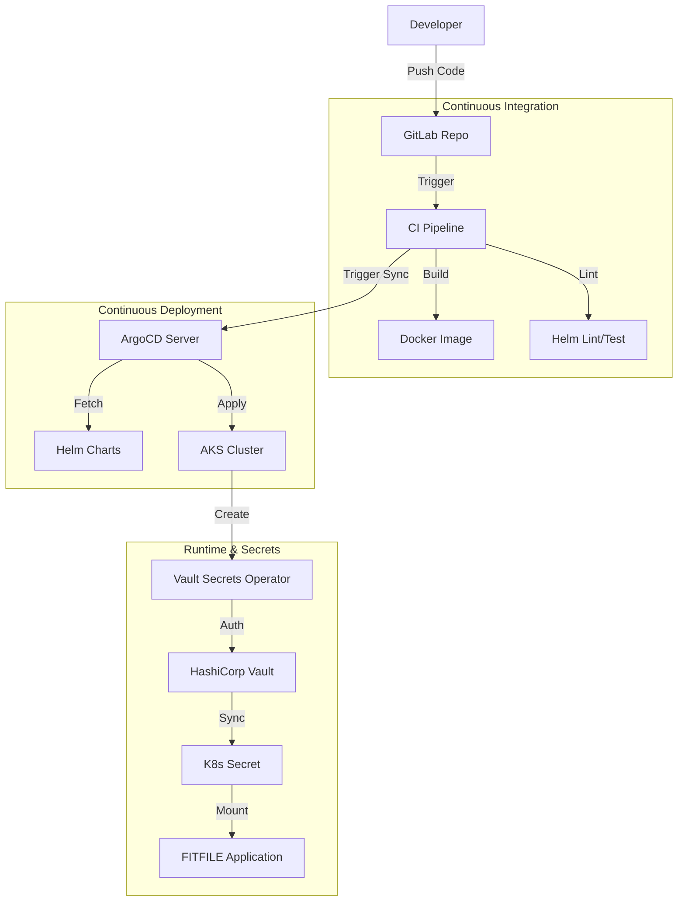

## 1. Definitive Statement

> [!definition] Definition
> The **FITFILE Platform** is a secure, cloud-agnostic data processing system designed for healthcare environments. Its deployment architecture utilizes **Infrastructure as Code (Terraform)**, **GitOps (ArgoCD)**, and **Helm Charts** to ensure reproducible, scalable, and compliant infrastructure across Azure and AWS.

---

## 2. The High-Level Flow (From Commit to Cloud)

The deployment process is a hybrid **CI-Driven GitOps** workflow. It combines the automation of GitLab CI with the state reconciliation of ArgoCD.



---

## 3. The Deployment Lifecycle

### Phase 1: Infrastructure Provisioning (Terraform)

Before any app deployment, the bedrock is laid via Terraform.

- **AWS/Azure Resources:** VPCs, AKS Clusters, Databases.
- **Repository:** `fitfile/infrastructure` (or similar).
- **Key Doc:** [[terraform-helm-fitfile-platform]]

#### Terraform Cloud (TFC) Workspace Setup

A TFC workspace is required for each new deployment.

1.  **Create Workspace:** Create a new workspace in the correct TFC project, linked to the GitLab repository containing the Terraform code for the deployment.
2.  **Terraform Version:** Ensure the workspace is using the latest version of Terraform.
3.  **Variables:** The workspace needs a set of environment variables to function. These can be applied via Variable Sets. Key variables to set manually are:
    -   `vault_namespace`: The Vault namespace for the deployment (e.g., `deployments/ff-hyve-1`).
    -   `approles`: A sensitive HCL variable containing the AppRole credentials for Terraform to authenticate with Vault. See [[MOC - FitFile Deployment]] for the command to generate this.

---

### Phase 2: Application Configuration (Helm)

Applications are packaged as Helm charts.

- **Umbrella Chart:** `charts/ffnode` acts as the standard deployment unit.
- **Configuration:** Customer-specific configuration lives in `ffnodes/fitfile/{customer-env}/values.yaml`.
- **Key Doc:** [[FFNODE as Umbrella Chart]]

### Phase 3: The Deployment Trigger (GitLab CI)

1. **Change:** A merge to `master` or a manual trigger on `staging`.
2. **Pipeline:** Executes `.gitlab-ci.yml`.
3. **Sync:** The pipeline contacts ArgoCD to force a synchronization of the application state.

### Phase 4: Runtime Reconciliation (ArgoCD & VSO)

1. **ArgoCD:** Detects the change in Helm values/charts and applies manifests to AKS.
2. **VSO:** Detects new `VaultStaticSecret` resources. It authenticates with Vault, fetches the secret data, and creates the Kubernetes `Secret`.
3. **Kubernetes:** Starts the Pods. The Pods mount the secrets and begin operation.

---

## 4. Infrastructure & Cloud Platforms

The platform supports a multi-cloud strategy, primarily focused on Azure and AWS.

### 4.1 Azure Infrastructure

- **Core Tooling:** [[Azure Tooling Configuration Guide]] provides the overview of Azure infrastructure configuration.
- **Identity Management:** Uses [[TFC Service Principle for Azure]] for Terraform Cloud deployments.
- **Customer Onboarding:** Follows the [[Azure Customer Checklist]].
- **Troubleshooting:** Common issues are documented in [[Errors Encountered During Azure Deployment]].

### 4.2 AWS Infrastructure

- **Networking:** Based on a [[SoT - Cloud Networking Core Components|Cloud Network]] design, utilizing a [[SoT - Cloud Networking Core Components|Hub-and-Spoke Architecture]] for centralized management.
- **VPC Resources:** Detailed in [[AWS resources associated with the hie sde VPC]].

---

## 5. Deployment Strategy (GitOps & IaC)

Deployment is managed via a strict GitOps workflow.

### 5.1 Infrastructure as Code (Terraform)

- **Configuration:** Managed via [[terraform-helm-fitfile-platform]].
- **Module Management:** Uses a [[Create a Central Version Catalog Module]] for dependency standardization.

### 5.2 Application Management (Helm & ArgoCD)

- **GitOps Controller:** [[ArgoCD App of Apps Architecture]] manages the application lifecycle.
- **Chart Architecture:** Utilizes [[FFNODE as Umbrella Chart]] pattern for aggregating services.
- **Lifecycle Management:** Governed by the [[Helm Chart Management Tool]] design.

---

## 6. Security & Secrets Management

Security is a first-class citizen, leveraging Vault for dynamic secrets and PKI.

### 6.1 Vault & PKI

- **Core Note:** [[SoT - FITFILE Secret Management Architecture]]
- **Infrastructure:** [[Vault PKI Infrastructure Documentation]] details the Public Key Infrastructure setup.
- **Integration:** [[Vault to Kubernetes Secrets Management Guide]] explains how secrets are injected into pods.
- **Troubleshooting:** See [[Errors Encountered During Azure Deployment|VaultClientConfigError]] for client configuration issues.

### 6.2 Network Security

- **Encryption:** Moves beyond basic HTTPS to advanced patterns ([[Why HTTPS is not good enough]]).
- **Access Control:** strict [[Calico Cloud vs Kubernetes Network Policies in GitOps|Network Policies]] and [[Proxy Allow list]] configuration.

---

## 7. Platform Components & Data Flow

### 7.1 Architecture

- **Overview:** [[FITFILE Platform Components]] defines the core services.
- **Pipelines:** [[SOT - CI-CD Pipelines]]
- **Data Pipeline:** [[FITFILE Platform Components|FITFILE Patient Data Transformation]] details the processing logic.

### 7.2 Storage

- **Database:** MongoDB configured via [[Mongo Helm Config]].
- **Object Storage:** MinIO managed via standard image import processes.

### 7.3 Connectivity

- **Ingress:** Managed by [[Nginx Ingress Controller Configuration]].
- **DNS:** Architecture defined in [[Core DNS Components and Environments]].

#### AWS DNS Configuration

For AWS deployments, the DNS zone is created using a dedicated `dns_zone` module. The DNS zone name is constructed based on the `deployment_key`. For example, a `deployment_key` of `ff-eoe-sde` will result in a private DNS zone named `ff-eoe-sde.privatelink.fitfile.net`.

This private DNS zone will have A records for `argocd` and `app` subdomains, pointing to the EKS load balancer.

```tf
module "dns_zone" {
  count = var.enable_dns_zone ? 1 : 0

  source = "./modules/dns_zone"

  name   = local.name
  vpc_id = module.vpc.vpc_id
  tags   = local.tags

  records = [
    {
      dns_name  = data.aws_lb.eks_elb.dns_name
      zone_id   = data.aws_lb.eks_elb.zone_id
      subdomain = "argocd"
      type      = "A"
    },
    {
      dns_name  = data.aws_lb.eks_elb.dns_name
      zone_id   = data.aws_lb.eks_elb.zone_id
      subdomain = "app"
      type      = "A"
    }
  ]
}
```

The `local.name` is set to the `deployment_key`. The `dns_zone` module then uses this to construct the full DNS zone name:

```tf
locals {
  dns_zone_name = coalesce(var.dns_zone_name, "${var.name}.privatelink.fitfile.net")
}
```

This is important for the Auth0 configuration, which depends on these DNS names.

---

## 8. Troubleshooting & Verification

### 8.1 Verification Steps

1. **ArgoCD UI:** Check for "Synced" and "Healthy" status.
2. **Pipeline Logs:** Check the `run_integration_tests` job output in GitLab.
3. **Cluster Check:** `kubectl get pods -n {namespace}`.

### 8.2 Common Failure Modes

- **Secret Sync Failure:** VSO cannot auth with Vault. Check `VaultAuth` resource. (See [[SoT - FITFILE Secret Management Architecture#4. Standardization Action Plan]])
- **Integration Test Fail:** The Argo Workflow failed. Check workflow logs via Argo UI.
- **Image Pull Error:** ACR credentials invalid or image missing.

---

## 9. Standards & Operations

### 9.1 Naming Conventions

- Resources must adhere to [[Cloud Resource Naming Convention - FITFILE - Confluence|Platform Naming Conventions]] and [[Resource Naming Convention]].

### 9.2 Prerequisites

- Deployments require meeting the [[Prerequisities]] and following the [[Deployment Configuration Guide]].

---

## 10. Related Components

- [[Repository Structure Refactoring for Clarity]] - Repository organization.
- [[Fitfile deployment fixes]] - Operational fixes.
- [[FITFILE Node Deployment Guide]] - Comprehensive guide for deploying FITFILE nodes.
- [[Phase 2 Infrastructure Deployment]] - Detailed infrastructure setup for AWS and Azure.
- [[FITFILE Deployment Docs]] - High-level deployment dependency graph and process.
- [[Azure Deployment Readiness Checklist]] - Readiness checklist.
- [[Kubernetes Backup and Disaster Recovery for AWS and Azure]] - Backup strategies.
