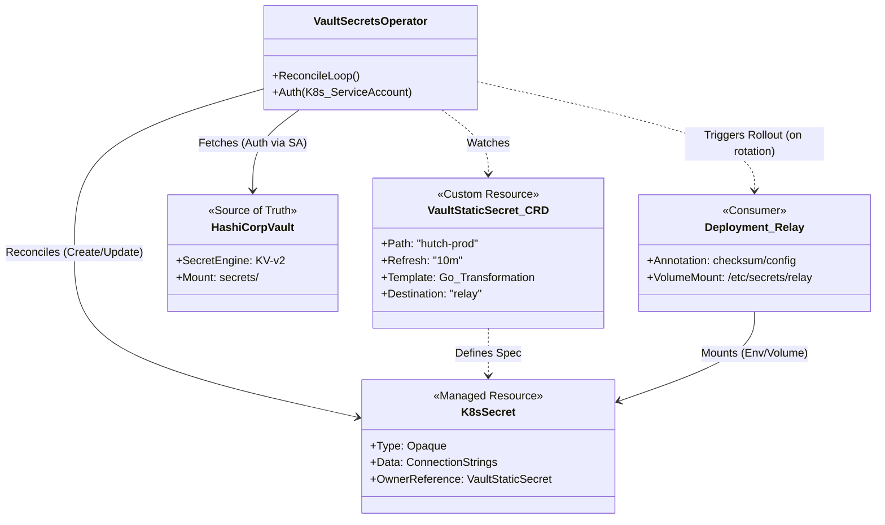

## 1. Executive Summary

The FITFILE platform enforces a "Secure by Design" secret management architecture using **HashiCorp Vault** and the **Vault Secrets Operator (VSO)**.

Currently, the deployment landscape is split:

1.  **Canonical (Standard):** Modern environments (e.g., `ffnodes/fitfile`, `cuh-prod-1`) use VSO to dynamically sync secrets from Vault.
2.  **Legacy (Debt):** Older environments (`stg`, `kch`) rely on a technical debt "hack" using hardcoded `vault-replacement-secrets.yaml` manifests.

**The Mandate:** All environments must converge on the Canonical Path defined in `charts/ffnode`.

---

## 2. The Canonical Architecture

The standard implementation leverages a data-driven approach where secrets are defined in Helm values and materialized by VSO.

### Core Components
1.  **HashiCorp Vault:** The central, encrypted source of truth for all secret data.
2.  **Vault Secrets Operator (VSO):** The Kubernetes operator that authenticates with Vault (via AppRole) and synchronizes secrets into Kubernetes `Secret` resources.
3.  **Helm / ArgoCD:** The delivery mechanism that configures VSO resources via the `ffnode` chart.

### The Configuration Flow
1.  **Definition:** Secrets are declared in `values.yaml` under `vaultSecrets` or `extraVaultSecrets`.
2.  **Generation:** The `charts/ffnode` helper `_helpers.tpl` (specifically `generateVaultDynamicSecrets`) processes these values.
3.  **Injection:** The helper generates `VaultStaticSecret` or `VaultDynamicSecret` CRDs.
4.  **Sync:** VSO detects the CRD, fetches the data from Vault, and creates a native Kubernetes Secret.

**Example Pattern:**

```yaml
# ffnodes/fitfile/ff-test-a/values.yaml
extraVaultSecrets:
  - secretName: "sleuth-secret"
    vaultPath: "ff-test-a-application"
    templates:
      apiKey: '{{`{{get .Secrets "sleuth_api_key"}}`}}'
```

---

## 3. Deployment Inventory & Status

### A. Canonical Deployments (VSO Enabled)
*Status: Healthy*

These environments purely use VSO and do not rely on hardcoded secrets.

| Deployment | Vault Namespace | Base Path | Key Secrets |
| :--- | :--- | :--- | :--- |
| **`cuh-prod-1`** | `admin/deployments/cuh-prod-1` | `cuh-prod-1-application` | `cloudflare-issuer-api-token`, `fitconnect`, `fitfile-rsa-private-key` |
| **`nnuh-prod-1`** | `admin/deployments/nnuh-prod-1` | `nnuh-prod-1-application` | `cloudflare-issuer-api-token`, `mongodb` |
| **`hie-prod-34`** | `admin/deployments/hie-prod-34` | `hie-prod-34-application` | `s3-export-secret` (Custom export creds) |

### B. Legacy Deployments (Technical Debt)
*Status: Remediation Required*

Environments like `stg` and `kch` currently fail to use VSO correctly, relying on `vault-replacement-secrets.yaml`.

**Root Cause:**
-   Likely network connectivity or `VaultAuth` misconfiguration in the specific clusters prevents VSO from authenticating.
-   "Hack" solution was applied to bypass the error, embedding secrets directly in git/deployment (Security Risk).

---

## 4. Standardization Action Plan

To eliminate the security risk and technical debt, we must migrate Legacy environments to the Canonical standard.

1.  **Verify VSO Status:** Ensure `vault-secrets-operator` is running in `kch` and `stg` clusters.
2.  **Fix Connectivity/Auth:** Debug the `VaultAuth` resource. Verify the cluster can reach the Vault endpoint and that AppRole credentials are valid.
3.  **Migrate Data:**
    -   Extract values from `vault-replacement-secrets.yaml`.
    -   Move them to `values.yaml` `extraVaultSecrets` configuration.
    -   Write the actual secret data into the relevant HashiCorp Vault path.
4.  **Delete the Hack:** Remove `templates/vault-replacement-secrets.yaml` entirely.

---

## 5. Reference Implementation: `hie-prod-34` (Deep Dive)

The `hie-prod-34` deployment provides a robust example of extending the canonical architecture using the `extraDeploy` pattern for third-party integrations (Hutch).

### The Architecture Patterns
1.  **Source of Truth:** External HashiCorp Vault (`admin/deployments/hie-prod-34`).
2.  **Delivery:** VSO via Helm `extraDeploy` injection.
3.  **Consumption:** Applications (Relay, Bunny) mount native Kubernetes Secrets, unaware of Vault.

### Implementation Specifics (`extraDeploy` Pattern)

While `charts/ffnode` uses `extraVaultSecrets`, the `hutch` chart integration in `ffnodes/eoe/hie-prod-34` uses `extraDeploy` to inject raw VSO resources. This is useful for third-party charts.

**Example: Relay Secret Definition**

```yaml
# ffnodes/eoe/hie-prod-34/hutch_prod_values.yaml
extraDeploy:
  - apiVersion: secrets.hashicorp.com/v1beta1
    kind: VaultStaticSecret
    metadata:
      name: relay
    spec:
      namespace: admin/deployments/hie-prod-34
      path: hutch-prod
      destination:
        create: true
        name: relay
        transformation:
          templates:
            db_connection_string:
              text: 'Host=hutch-prod-postgresql;...;User Id={{`{{get .Secrets "relay_postgresql_username"}}`}}...'
```

### Dependency Diagram

This flow illustrates the reconciliation loop between the Helm manifest, the VSO controller, and the running application.



---

## 6. Related Documentation

-   **Deep Dive:** [[Vault to Kubernetes Secrets Management Guide]] - Detailed steps on adding new secrets.
-   **Principles:** [[General Principles for Adding Secrets]] - Best practices for secret management.
-   **Platform:** [[SoT - FITFILE Platform Deployment]] - Broader platform context.
