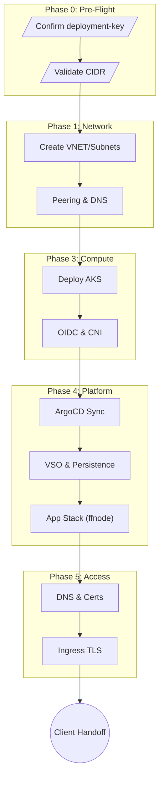

## 1. Overview & Critical Path

This manual details the six-phase execution of a FITFILE deployment. It serves as the primary checklist for Deployment Engineers.

Critical Path Summary:

`CIDR Validation` → `VNET` → `Peering` → `AKS` → `OIDC` → `VSO` → `ffcloud` → `frontend` → `Ingress` → `DNS` → `CLIENT ROUTES` → `Smoke Tests`

> [!danger] Primary Friction Points
> 1. Client-side Inbound Routes: Often the longest blocker. Initiate Phase 1.5/1.6 immediately.
> 2. Vault-VSO Propagation: Requires ~15-30min for Workload Identity to sync.
> 3. Split-Horizon DNS: Private Zones must link to _both_ Customer and Hub VNETs.

---

## Phase 0: Pre-Flight Validation

Goal: Verify prerequisites before creating resources to prevent silent failures later.

| Step | Action | Prerequisite | Verification |
|:---|:---|:---|:---|
| 0.1 | Confirm `deployment-key` | Onboarding initiated | Check Terraform workspace exists (e.g., `lca-prd-01`). |
| 0.2 | Verify Azure Access | SP credentials in Vault | `az account show` via Jumpbox. |
| 0.3 | Validate CIDR Allocation | Network planning | Ensure `10.x.x.x/16` does NOT overlap with Client On-Prem. |
| 0.4 | Validate Vault Path | HCP Namespace exists | `vault kv list admin/central/{customer_id}` |

> [!warning] CIDR Overlap
> If the customer's on-premise network overlaps with the Azure VNET CIDR, VNET peering will silently fail. Stop if this is not confirmed.

---

## Phase 1: Network Provisioning (The Bedrock)

Goal: Establish the network fabric and connectivity to Central Services.

1. Create VNET: Apply Terraform to provision VNET and Subnets (System, Egress/Ingress, Jumpbox).
   - _Verify:_ `az network vnet show -n vnet-{customer_id}-prd-01`
2. Establish Peering: Connect Customer VNET to Central Services Hub VNET.
   - _Verify:_ Peering state is `Connected`.
3. Configure DNS: Link `{customer_id}.internal` Private DNS Zone to BOTH VNETs.
   - _Why:_ Prevents `NXDOMAIN` errors when pulling Helm charts from the Hub.
4. Client Action (Load Balancer): Provide the static Public IP to the client network team.
5. Client Action (Firewall): Request inbound HTTPS (443) allow-list for the LB IP.

> [!caution] Peering Propagation
> Route tables may take 5 minutes to propagate after "Connected" state. Ping a Hub resource from the Jumpbox before proceeding.

---

## Phase 2: Central Services Integration (The Control Plane)

Goal: Establish identities, secrets, and repositories.

1. GitLab Repo: Create `FITFILE/Deployment/charts/{customer_id}` using the standard template.
2. ArgoCD Token: Generate a Group Access Token (Scope: `read_repository`, Role: `Reporter`) for the specific subgroup.
   - _Warning:_ Do not use a parent group token (Shadowing risk).
3. Vault Path: Create `deployments/{deployment-key}/` in HCP Vault.
4. Seed Secrets: Inject initial secrets (ACR Pull, Database Credentials) into the Vault path.
   - _Verify:_ Secrets count ≥ 5.

---

## Phase 3: AKS Cluster Deployment

Goal: Provision the compute layer and hardened baseline.

Detailed Guide: [[SoT - FitFile Deployment - Phase 2 - Core Infrastructure]] (Note: Phase numbering alignment differs in detailed guide)

1. Deploy AKS: Execute `terraform apply` for the cluster module.
   - _Verify:_ `az aks show` returns cluster details.
2. Enable OIDC: Verify OIDC Issuer is enabled for Workload Identity.
3. Install CNI: Deploy/Verify Calico CNI.
   - _Note:_ Tigera Webapp is deprecated; use `kubectl` for policy validation.
4. Deploy Ingress Controller: Ensure NGINX Ingress Service acquires the Static Public IP from Phase 1.
5. Workload Identity: Wait 15-30 mins for identity propagation before deploying VSO.

---

## Phase 4: Platform Deployment (The Cluster OS)

Goal: Deploy the software stack via GitOps (ArgoCD).

Detailed Guide: [[SoT - FitFile Deployment - Helm Architecture & Operations]] & [[SoT - FitFile Deployment - Platform Module]]

1. ArgoCD App: Apply the master Application manifest pointing to the GitLab repo.
2. Deploy Core Stack:
   - `cert-manager` (Wait for Running)
   - `persistence` (PostgreSQL, MongoDB, MinIO - Check PVC binding)
   - `vault-secrets-operator` (VSO)
3. Verify Secret Sync: Check `kubectl get vaultstaticsecret`.
   - _Troubleshoot:_ If status is `Unknown`, restart `argocd-repo-server` to clear cache.
4. Deploy Application:
   - `ffcloud` (Coordinating Station)
   - `fitconnect`
   - `frontend`
   - `spicedb` (Check datastore connection)

---

## Phase 5: Certificate & Ingress Configuration

Goal: Enable secure external access.

1. DNS A-Record: Create `*.{customer_id}.fitfile.net` (or internal equivalent) pointing to the Load Balancer IP.
2. Certificate: Verify `cert-manager` issues the TLS certificate (Let's Encrypt or Internal CA).
   - _Warning:_ DNS must propagate before ACME challenge runs.
3. Ingress Host: Ensure `values.yaml` host matches the DNS record.
4. Validation: `curl -v https://{host}` should return a valid TLS handshake.

---

## Phase 6: Client Handoff & Validation

Goal: Verify end-to-end user flows.

1. Client Routing: Client confirms inbound routes are active.
2. Egress Whitelist: Client confirms outbound access to Central Services (if strict firewalling applies).
3. Auth0 Login: Validate login flow redirects correctly and returns a valid JWT.
4. Smoke Test: Execute a sample workflow submission and data upload.

---

## Deployment Logic Flow

