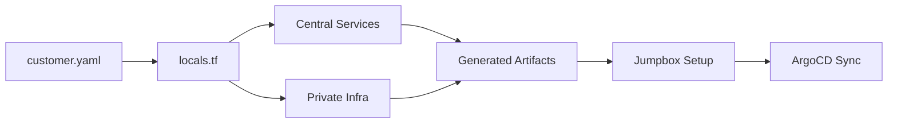

## 1. Executive Summary

The FITFILE platform utilizes a Three-Tier Deployment Architecture optimized for security, scalability, and high-velocity updates via GitOps.

- Infrastructure Layer: Private cloud bedrock (EKS/AKS) managed via Terraform.
- Platform Layer: The "Cluster OS" (ArgoCD, Vault Secrets Operator, Ingress).
- Application Layer: FITFILE microservices deployed as a unified unit (FFNode).

The Deployment Key: A unique identifier (e.g., `WM-Prod`) serves as the primary namespace and prefix for all resources, from Vault paths to Azure Management Groups.

---

## 2. Cloud Hierarchy (Landing Zone)

FITFILE follows the Enterprise-Scale Landing Zone pattern, separating platform governance from customer workloads.

### 2.1 Management Group Structure

- FITFILE Root Group: Top-level governance.
- Platform Subscriptions: Shared services (DNS, Identity, Management/Monitoring).
- Landing Zone Subscriptions: Isolated environments for Production (Customer COGS) and Non-Production (R&D).

### 2.2 Security Invariants

- Zero Public Access: No public endpoints for cluster APIs or Jumpboxes.
- Identity-Centric: Managed Identities (Azure) or IAM Roles (AWS) for infrastructure operations.
- Least Privilege: Terraform Service Principals are constrained to specific Resource Groups and required Actions (Network, Compute, Identity).

---

## 3. Terraform Design: The Generative Engine

Our IaC logic orchestrates a multi-repo flow using a Generative Engine approach. We separate the Logical Model (intent) from the Physical Implementation (resources).

### 3.1 Two-Module Architecture

The Root Module orchestrates two specialized submodules:

1. Central Services Consumer: Provisions SaaS platform services (GitLab projects, TFC workspaces, Auth0 apps, Vault namespaces).
2. Private Infrastructure: Deploys the cloud fabric (VNet, Subnets, AKS, NAT Gateway, Bastion, Jumpbox).

### 3.2 Data Flow Pipeline

### 3.3 Portability Invariants

To ensure the framework is portable across regions and customers:

- Dynamic Repository URLs: Generated from `gitlab_group` and `customer_name` in `customer.yaml`.
- Dynamic Workspace Names: `providers.tf` is generated from a template to inject the correct TFC workspace name at runtime.
- Zero Hardcoding: All string derivations (resource names, DNS zones) must flow from the configuration kernel.

---

## 4. GitOps & CI/CD Strategy

The deployment process is a hybrid CI-Driven GitOps workflow.

1. CI (GitLab): Builds Docker images, lints Helm charts, and runs integration tests.
2. GitOps (ArgoCD): Orchestrates the cluster state by reconciling the deployment repository with the live environment.
3. The Umbrella Pattern: We use the `ffnode` umbrella chart to manage all microservices (MongoDB, APIs, etc.) as a single logical commit. See [[SoT - FitFile Deployment - Helm Architecture & Operations]].

---

## 5. Security Architecture

- Private Networking: Clusters reside in private subnets with strictly controlled NAT/Internet egress. See [[SoT - FitFile Deployment - Networking and Security]].
- Vault-Backed Secrets: Zero secrets in Git. The Vault Secrets Operator (VSO) synchronizes encrypted data from HCP Vault into Kubernetes native secrets at runtime. See [[SoT - FitFile VSO Secrets Management]].
- Auth0 Offloading: Application-level authentication is handled by Auth0, decoupled from the infrastructure identity. See [[SoT - FitFile Identity & Access Management (Auth0)]].

---

## 6. Project-Specific Contexts

- [[lca-prd-2-identity-credential-map]] (Gold Standard implementation for LCA)
- [[aks-cluster-bootstrap-debug-runbook]] (Operational troubleshooting)
