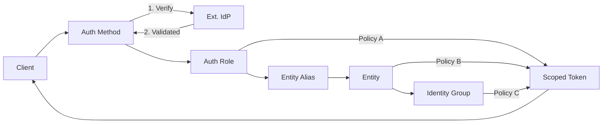

# 1. The First-Principles Mental Model

To understand Vault at a structural level, we must strip away the security vernacular ("secrets," "sealing") and view it as a data system.

> [!definition] Definition
> HashiCorp Vault is a Persistent, Content-Addressed Merkle Tree wrapped in a RESTful interface, serving as a Versioned Trie of JSON Documents.

It is not a "database" in the relational sense. It is a virtualized filesystem where "Encryption" is merely a transformation layer applied before persistence.

# 2. The Data Structure: The Versioned Trie

The core organizing primitive of Vault is the Path.

## 2.1 The Prefix Tree (Routing)

Vault organizes data in a Radix Trie (Prefix Tree).

- Nodes: Each segment of a path (e.g., `secret/`, `data/`, `app/`) is a node in the tree.
- Leaves: The actual "Secret" is a JSON object stored at a leaf node.
- Mounts: Logical backends (KV, Transit, PKI) "mount" at specific prefixes, claiming that branch of the Trie.

## 2.2 The KV-V2 Data Model

When using the KV Version 2 engine, the leaf node is not a simple value. It is a Linked List of Snapshots.

- Path Separation: Vault strictly separates the _Payload_ from the _Metadata_ in the URI schema:
    - `secret/data/…` -> Accesses the JSON payload (The Value).
    - `secret/metadata/…` -> Accesses the version history and settings (The Framework).
- Atomic Put: There is no "PATCH" for a secret. Every write is a full replacement of the JSON object, creating a new version node.

# 3. Storage Integrity: The Merkle Tree

While the Trie handles routing (finding data), the Merkle Tree handles integrity and synchronization (proving data validity).

## 3.1 Recursive Integrity

Vault Enterprise Replication uses a Merkle Tree structure for state synchronization.

- Leaf Hashes: Hash of the secret data.
- Branch Hashes: Hash of children hashes.
- Root Hash: A single 32-byte signature representing the entire state of the vault.

## 3.2 The Sync Logic (Merkle Diff)

This allows distinct clusters to synchronize without transmitting the full dataset:

1. Compare Root Hashes.
2. If distinct, traverse down the "Dirty" Branch.
3. Identify the specific Leaf Node that differs.
4. Replicate only that node.

# 4. Access Control: Path-Based Bitmasks

In this data-centric model, ACL Policies are not abstract permissions; they are Regex-Based Filters applied to the Request Path.

- The Filter: A Policy maps a `Path Prefix` to a `Capability Set` (Bitmask: Create, Read, Update, Delete, List).
- Resolution: Vault uses Longest Prefix Match (LPM) (similar to IP routing) to find the most specific policy rule for a requested path.
- Implicit Deny: If the path does not match a filter allowing access, the node effectively _does not exist_ for that identity (404/403).

# 5. Integration: The Vault Secrets Operator (VSO)

The [[SoT - FITFILE Secret Management Architecture|Vault Secrets Operator]] acts as a bridge between Vault's Identity-Based model and Kubernetes' Namespace-Based model.

## 5.1 The Transformation Pipeline

1. Source: Versioned JSON Object in Vault (Path-addressed).
2. Bridge: VSO Authenticates via Kubernetes JWT (Identity Brokering).
3. Sink: Flat Map of Strings in a Kubernetes Secret (Namespace-addressed).

## 5.2 Dynamic vs. Static

- Static: Mirroring a JSON document. (Storage).
- Dynamic: Triggering a "Generator" function at a path to create ephemeral credentials with a TTL (Time-To-Live).

# 6. Identity & Access Protocols (The Resolution Flow)

Vault decouples Authentication (External) from Authorization (Internal) via a state-transition logic that normalizes identities.

## 6.1 The Core Triad

- Authentication (Auth Methods): Untrusted external verification (AWS, K8s, GitHub).
- Identity System (Entities/Groups): Vault-native abstraction.
- Authorization (Policies): Scoped boolean (Allow/Deny) functions.

## 6.2 The Resolution Engine

The flow follows a path from Untrusted Credential to Scoped Token:

1. Verification: The Auth Method (Mount) validates external claims.
2. Entity Resolution: Vault maps the external identifier to a persistent Entity Alias.
3. Group Aggregation: Vault resolves the Entity's membership in Identity Groups (Internal or External).
4. Policy Compilation: Vault performs a Union Operation of all policies attached to the Auth Role, the Entity, and the Groups.
5. Token Issuance: An ephemeral Token is minted containing the aggregated capabilities.

> [!architectural-tip] Binding Strategy
> Always bind policies to Identity Groups, not Auth Roles or individual Entities. This allows for "Identity Swapping" (e.g., migrating from AWS to Kubernetes) without re-writing permission sets.

# 7. Visual Representation (The Logic Flow)

# 8. The Barrier: Encryption Layer

Everything described above happens _inside_ the "Barrier."

- Storage Backend: The physical storage (Consul, Raft, S3) sees only encrypted blobs.
- The Barrier: A cryptographic membrane. The Trie and Merkle structures exist in memory (or encrypted on disk) and are only intelligible when the Barrier is "Unsealed" (Decryption Key provided).
