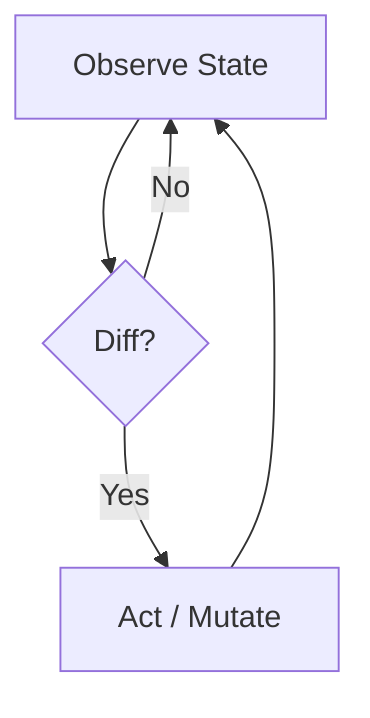

---
aliases:
- K8s Architecture
- K8s Cluster State
- K8s Mental Model
created: 2025-12-16 00:00:00+00:00
last_reviewed: '2025-12-16'
modified: 2026-02-05 19:59:47+00:00
status: stable
tags:
- devops
- etcd
- kubernetes
- mental_model
- SoftwareEngineering/Architecture
title: SoT - Kubernetes Cluster State Architecture
type: SoT
updated: null
permalink: llmeon/30-library/so-t/so-t-kubernetes-cluster-state-architecture
---

## Minimum Viable Understanding (MVU)

Kubernetes is not a "Container Orchestrator" in the traditional sense; it is a Distributed Database (etcd) wrapped in a set of Reconciliation Loops (Controllers). The "Cluster" is simply the eventually consistent materialization of the state stored in etcd.

---

## 1. The Core Data Structure (etcd)

At its heart, Kubernetes is a B+Tree key-value store.

- Keys: Hierarchical paths (e.g., `/registry/pods/default/nginx-1`).
- Values: Serialized Protobuf/JSON objects representing the _Intent_ (Spec) and _Status_.
- Consistency: Strict consistency (CP system) ensures that while the _nodes_ may drift, the _definition_ of the cluster is always authoritative.

### The "Event Log" Pattern

Kubernetes does not just store state; it emits a stream of Change Events (WATCH) whenever that state mutates. Controllers subscribe to this stream, creating an event-driven architecture.

---

## 2. The Reconciliation Loop (The Algorithm)

The logic of Kubernetes is decentralized into independent loops that constantly compare `Spec` (Desired State) vs. `Status` (Actual State).

This is why Kubernetes is "Self-Healing." It doesn't execute a sequence of steps (Imperative); it converges on a target state (Declarative).

---

## 3. Ephemeral vs. Durable State

| Component | Storage Location | Durability |
|:--- |:--- |:--- |
| Workloads (Deployments) | etcd | High (The definition persists) |
| Pod Filesystem | Node Disk | None (Dies with the container) |
| Volumes (PV/PVC) | Cloud Block Store | High (Independent of Pod lifecycle) |
| Logs | Node `/var/log` | Low (Rotated/Deleted; needs external shipping) |

---

## 4. The Namespace Abstraction

Namespaces are Virtual Clusters backed by the same physical etcd. They provide:

- Scope: Unique names within the namespace.
- Quota: Resource limits (CPU/RAM).
- Access: RBAC boundaries.

They do _not_ provide:

- Network Isolation: (Requires NetworkPolicies).
- Node Isolation: (Requires NodeSelectors/Taints).

---

## Related Concepts

- [[SoT - Conservation of Complexity]]: Kubernetes shifts complexity from "Runbooks" (Code) to "Manifests" (Data/Representation).
- [[SoT - Git]]: GitOps treats Git as the "upstream" etcd.