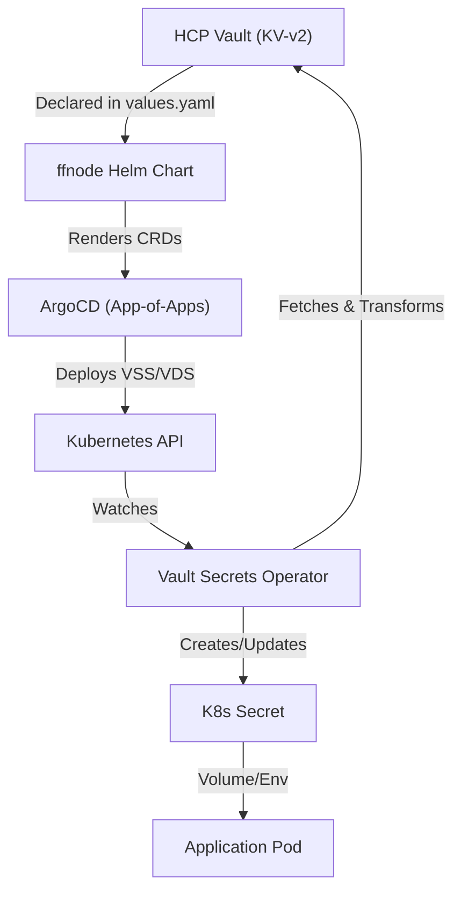

## Minimum Viable Understanding (MVU)

FITFILE uses a Data-Driven Secret Lifecycle where HCP Vault is the encrypted source of truth. Secrets are declared in Helm values, rendered as `VaultStaticSecret` (VSS) or `VaultDynamicSecret` (VDS) CRDs by the `ffnode` chart, and materialized into Kubernetes by the Vault Secrets Operator (VSO).

## Working Knowledge

### 1. The Architectural Flow

### 2. Technical Implementation (Helm Layer)

The `ffnode` umbrella chart uses a helper logic (`renderValuesWithVaultSecretInExtraDeploy`) to process secret arrays and append CRDs to `extraDeploy`.

- Primary Auth: AppRole (Legacy) or JWT (Preferred) via `VaultAuth` resources.
- Pathing: Uses `.Values.deploymentKey` to scope Vault namespaces (e.g., `admin/deployments/prod-1`).

### 3. Presets & Shorthand

To reduce boilerplate, `_helpers.tpl` supports `preset:` mappings:

- `mongodb`: Maps `mongodb-replica-set-key` and `mongodb-root-password`.
- `postgresql`: Maps `postgres-password`.
- `auth0`: Maps `client-id` and `client-secret`.

### 4. Secret Inventory (Key Components)

| K8s Secret | Vault Path | Injection |
|:--- |:--- |:--- |
| `mongodb`/`postgresql` | `application` | Env (existingSecret) |
| `fitconnect`/`ffcloud` | `application` | Volume (`/secrets/`) |
| `argo-postgres-config`| `argo-workflows` | Env (secretKeyRef) |
| `cloudflare-issuer…`| `cloudflare` | Volume (cert-manager) |

## Current Understanding

### 1. Tensions & Known Issues

- KCH Hardcoded Secrets: High-priority debt where base64 secrets are committed in `vault-replacement-secrets.yaml`.
- Template Complexity: Double-escaping in Helm (`'{{"{{`{{get.Secrets \"key\"}}`}}"}}'`) is a significant friction point for developers.
- Local Dev Gap: Lack of a standard "Vault-less" local development workflow.

### 2. Strategy & Improvement Plan

- Phase 1 (Security): Immediate rotation of KCH secrets and migration to VSO; enforcing a strict `refreshAfter` policy (5m for apps, 1h for infra).
- Phase 2 (DevEx): Implementing a `docs/secret-registry.yaml` as a checklist and providing `scripts/secret-debug.sh`.
- Phase 3 (Hardening): Transitioning `VaultAuth` to code and adding CUE validation in CI to catch mapping errors before merge.

## Operational Standards (The Golden Path)

1. Vault: Write key/value to `secrets/{deploymentKey}/secrets/application`.
2. Helm: Declare in `values.yaml` using `vaultSecrets` or `extraVaultSecrets`.
3. Consumption: Map the resulting K8s Secret via `volumeMounts` or `envFrom`.
4. Validation: Check sync status with `kubectl get vss -n <ns>`.

---

## Related Documentation

- [[MoC - Secrets & Vault Management]]
- [[Protocol - VSO Secret Management & Troubleshooting]]
- [[ARGO_VSO_ROOT_CAUSE]]
