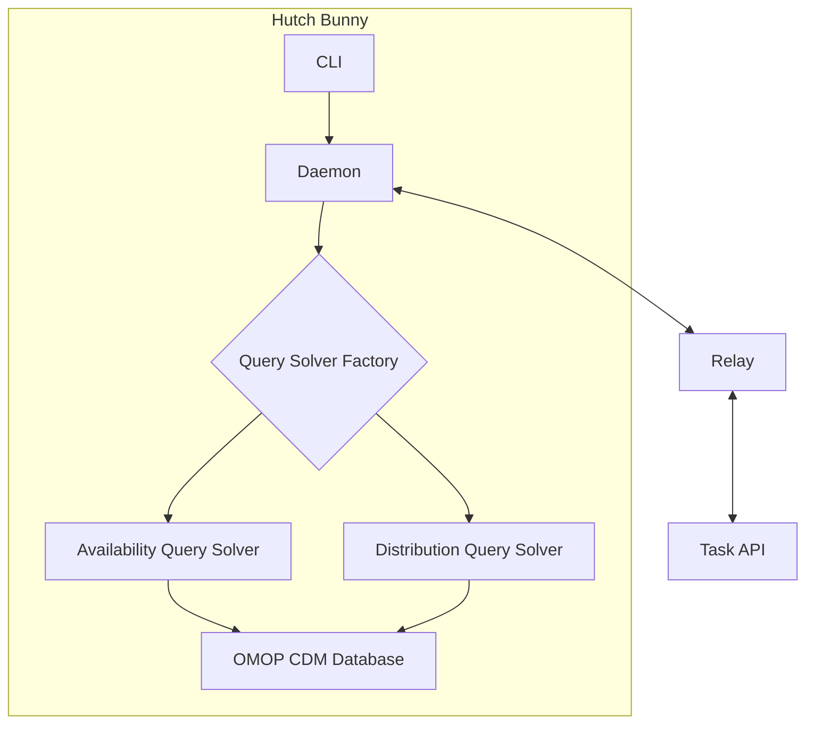

# Code review

Project Name: Hutch Bunny 🐇

Main Purpose:
This is an HDR UK (Health Data Research UK) Cohort Discovery Task Resolver. It's designed to fetch and resolve Availability and Distribution Queries against OMOP-CDM (Observational Medical Outcomes Partnership Common Data Model) databases.

Key Features:

1. Query Resolution:

- Handles demographic distribution queries

- Processes availability queries

- Works with OMOP-CDM databases

1. Data Processing:

- Supports result obfuscation

- Handles query execution and result formatting

- Returns results in JSON format

1. Database Support:

- Multiple database backends (PostgreSQL, MySQL, SQL Server)

- Configurable database connections

- Schema-aware operations

Entry Points:

1. CLI Interface (`bunny`):

- Main entry point through `src/hutch_bunny/cli.py`

- Takes query input as JSON

- Processes queries and saves results to output files

1. Daemon Mode (`bunny-daemon`):

- Alternative entry point for continuous operation

Technical Stack:

- Python 3.13+

- Key Dependencies:

- numpy, pandas for data processing

- SQLAlchemy for database operations

- psycopg for PostgreSQL

- trino for distributed SQL queries

- Support for multiple database drivers

Deployment:

- Docker support (has Dockerfile)

- Available as container images

- MIT Licensed

The project appears to be part of a larger health informatics infrastructure, specifically focused on cohort discovery and analysis in medical databases. It's designed to be flexible with database backends while maintaining a standardized interface for querying and result presentation.

Based on the documentation, here's how the projects are related and what hutch-bunny does:

Relationship:

1. Hutch is a larger ecosystem for health data research, and hutch-bunny is a key component within it

2. The website project serves as the documentation hub for all Hutch components, including hutch-bunny

Hutch-bunny's Purpose:

1. Core Functionality:

- Acts as a query resolver for cohort discovery against OMOP-CDM databases

- Can work standalone or as part of a federated network

- Safely executes queries behind institutional firewalls

1. Key Features:

- Task API Integration: Can fetch queries from:

- HDR Cohort Discovery tool

- Hutch Relay (for federated networks)

- Other compatible Task APIs

- Data Protection:

- Supports result obfuscation

- Low number suppression

- Result rounding

- Only makes outgoing requests for security

- Deployment Options:

- Can run as a daemon service

- Command-line interface (CLI) for direct query execution

- Docker container support

1. Technical Architecture:

- Uses SQLAlchemy for database operations

- Supports multiple database backends (PostgreSQL, etc.)

- Implements OMOP Common Data Model for health data

- Provides both synchronous and asynchronous query execution

1. Query Types:

- Availability queries

- Distribution queries

- Demographics analysis

- PHEWAS (Phenome-wide association studies)

- Analytics (GWAS, Burden Test)

The website project provides comprehensive documentation for:

- Configuration options

- Deployment guides

- API references

- Integration instructions

- Security considerations

- Best practices for using hutch-bunny in different scenarios

In essence, hutch-bunny is the worker component that actually executes the queries and handles the data, while the website provides the documentation and guidance for using it effectively.

The Hutch-bunny codebase doesn't appear to have a test suite. However, I can see several test files present. It looks like the tests aim to confirm that Hutch-bunny can:

1. Connect to the database: The tests verify that Hutch-bunny can establish a connection to the specified database using the provided credentials. This is essential for all other database operations.

2. Handle Availability Queries: The tests check that Hutch-bunny can correctly interpret and process Availability Queries, which are used to determine the number of individuals matching specific criteria in the database.

3. Handle Distribution Queries: Tests are in place to confirm that Hutch-bunny can handle Distribution Queries. These queries compute statistics about the distribution of data elements, such as demographics or ICD codes.

4. Apply Result Modifiers: The tests check that Hutch-bunny can correctly apply result modifiers. These modifiers are used to protect privacy by suppressing or rounding sensitive data before returning the results.

For example, in `test_return.py`, the test `test_solve_availability_count_matches` confirms that the count of individuals returned by an Availability Query matches the expected count. This test ensures that Hutch-bunny can correctly interpret and process these types of queries.

Similarly, `test_demographics_distribution_query.py` tests the `solve_distribution` function for different types of Distribution Queries, such as demographics distribution, to check that the generated result matches the expected format and content.

The tests you have implemented provide a good starting point for ensuring the correctness of Hutch-bunny's core functionality. However, you should consider adding more tests to cover other aspects, such as:

- Different Database Backends: Currently, the tests only cover PostgreSQL. You might want to add tests for other database backends supported by Hutch-bunny, such as Trino.

- Error Handling: You should add tests to verify that Hutch-bunny correctly handles error conditions, such as invalid query formats or database connection issues.

- Edge Cases: It's essential to test edge cases, such as queries with no matching individuals or queries that result in very large result sets.

- Performance: You might consider adding performance tests to ensure that Hutch-bunny can handle large queries and datasets efficiently.

By expanding your test suite to cover these additional aspects, you can improve the reliability and robustness of Hutch-bunny, making it a more trustworthy tool for cohort discovery.

Hutch-bunny handles distributed queries using a modular approach.

The main modules involved are:

1. `core/query_solvers.py`: This module contains the logic for interpreting and solving different types of queries, including distribution queries. It defines several solver classes:

- `BaseDistributionQuerySolver`: An abstract base class for all distribution query solvers. It defines the interface that concrete solvers must implement.

- `CodeDistributionQuerySolver`: This class handles distribution queries that compute the distribution of data elements across the entire dataset, such as the distribution of ICD codes.

- `DemographicsDistributionQuerySolver`: This class handles distribution queries specifically for demographic information, such as age and gender distribution.

1. `core/execute_query.py`: This module orchestrates the query execution process.

- It receives a query from the user.

- It determines the type of query (availability or distribution) based on the presence of the `"analysis"` key in the query.

- It calls the appropriate query solver based on the query type and code.

The code determines the appropriate solver class to use based on the `code` field of the `DistributionQuery` object. For example, if `query.code` is `DistributionQueryType.GENERIC`, it uses the `CodeDistributionQuerySolver` to calculate and return the data distribution.

You can find the code for these modules in your Hutch-bunny project:

This modular approach allows you to easily extend Hutch-bunny to support new types of distribution queries by simply creating new solver classes that inherit from `BaseDistributionQuerySolver` and implement the required methods.

Both the `CodeDistributionQuerySolver` and `DemographicsDistributionQuerySolver` in the Hutch-bunny project calculate distributions by counting occurrences of specific values within your data, but they differ in their scope and output format:

CodeDistributionQuerySolver

This class focuses on calculating the distribution of codes across various medical domains. Here's a breakdown:

1. Data Aggregation: It retrieves counts of occurrences for each concept ID within the specified domains (condition, ethnicity, drug, gender, race, measurement, observation, procedure). This is achieved using SQL's `COUNT` and `GROUP BY` clauses.

2. Descriptive Statistics: While the current implementation doesn't compute descriptive statistics like min, max, quartiles, or mean, it gathers the data needed for such calculations. These statistics are part of the output table structure, implying a future enhancement to include them.

3. Output Format: The results are formatted as a tab-separated string, suitable for saving as a `.tsv` file. Each row in the output represents a unique concept ID and its associated count, description, and other relevant information.

DemographicsDistributionQuerySolver

This class specifically handles the distribution of demographic information:

1. Limited Scope: It currently focuses only on the "Gender" domain, as indicated by the `allowed_domains_map` and `domain_concept_id_map`.

2. Aggregated Counts and Category Breakdown: It calculates the total count for each gender and provides a more categorized output. The "ALTERNATIVES" column lists all gender categories and their respective counts within a single row, using a delimited format.

3. Output Format: Similar to the `CodeDistributionQuerySolver`, it produces a tab-separated string representing the results table, suitable for a `.tsv` file.

Algorithms and Techniques

The core technique used by both solvers is frequency counting, a simple form of distribution analysis.

- SQL Queries: Both solvers heavily rely on SQL queries with aggregation functions (`COUNT`) and grouping (`GROUP BY`) to perform the frequency counting directly within the database.

- Data Transformation: After fetching data from the database, they use the Pandas library for data manipulation and formatting the output into the desired tab-separated string.

Potential Improvements:

- Descriptive Statistics in `CodeDistributionQuerySolver`: Implement the calculation of min, max, quartiles, and mean to provide a more complete statistical overview.

- Expanding `DemographicsDistributionQuerySolver`: Extend the scope to include other demographic variables like race and ethnicity.

- Visualization: Consider adding functionality to generate visual representations (histograms, bar charts) of the distributions for easier interpretation.

Let me know if you would like more details on a specific part of the code or have any other questions.

The `CodeDistributionQuerySolver` uses SQL's `COUNT` and `GROUP BY` clauses within its queries to calculate the frequency of each concept ID.

Here's an example of how this query would look for the "Condition" domain:

```sql
SELECT COUNT(condition_occurrence.person_id), condition_concept_id
FROM condition_occurrence
GROUP BY condition_concept_id;
```

This query will return a table containing the count of persons associated with each `condition_concept_id` from the `condition_occurrence` table.

The code iterates through each domain defined in `allowed_domains_map` in

The `allowed_domains_map` in

It's possible for the `CodeDistributionQuerySolver` to encounter a domain not present in the `allowed_domains_map`. This could happen if:

1. New Domain: A new medical concept domain is added to the data source (the OMOP database) that isn't yet reflected in Hutch-bunny's configuration.

2. User Error: A user might submit a query with a typo or an invalid domain name.

Currently, the code doesn't have explicit error handling for this scenario. If a domain is not found in `allowed_domains_map`, the loop will skip it without any warning or error message.

It would be beneficial to add a check and handle this situation more robustly. For example, you could:

1. Log a warning: If a domain is not found, log a warning message indicating the unknown domain. This would help in identifying potential configuration issues or invalid user inputs.

2. Raise an error: For stricter control, you could raise a `ValueError` if an unknown domain is encountered. This would explicitly inform the user about the invalid domain and prevent the query from proceeding with potentially incomplete results.

By implementing these error-handling mechanisms, you can improve the robustness and reliability of the `CodeDistributionQuerySolver`.

Based on the code analysis, here's how the distribution calculations work:

1. CodeDistributionQuerySolver:

- Purpose: Calculates distributions across different medical domains (Conditions, Drugs, Measurements, etc.)

- Algorithm:

1. For each supported domain (defined in `allowed_domains_map`):

   - Queries the database to count patients per concept ID using SQL GROUP BY

   - Maps concept IDs to their descriptions from the concept table

   - Collects metadata like biobank ID and category

2. Creates a DataFrame with columns:

   - BIOBANK: Collection identifier

   - CODE: OMOP concept code

   - COUNT: Number of patients

   - DESCRIPTION: Concept description

   - Statistical measures (MIN, Q1, MEDIAN, MEAN, Q3, MAX)

   - ALTERNATIVES: Alternative codes

   - DATASET: Source dataset

   - OMOP: OMOP concept ID

   - CATEGORY: Domain category

3. Returns results as a tab-separated string with row count

4. DemographicsDistributionQuerySolver:

- Purpose: Specifically handles demographic distributions (currently only Gender)

- Algorithm:

1. More focused than CodeDistributionQuerySolver, only works with Person table

2. For each demographic domain:

   - Counts patients per demographic concept (e.g., gender)

   - Joins with concept table to get descriptions

   - Creates alternative representation with format: `^ConceptName|Count^`

3. Creates a DataFrame with similar columns but:

   - Sets CATEGORY to "DEMOGRAPHICS"

   - Includes detailed alternatives string showing distribution

   - Uses table name as DATASET

4. Returns results as tab-separated string with row count

Key Features of Both Solvers:

1. SQL Optimization:

- Uses SQLAlchemy's `select` and `func.count` for efficient aggregation

- Performs GROUP BY operations at database level

- Uses pandas for post-processing and formatting

1. Data Organization:

- Both use predefined mappings for:

- Allowed domains (`allowed_domains_map`)

- Concept ID columns (`domain_concept_id_map`)

- Output column structure (`output_cols`)

1. Error Handling:

- Wrapped in try-catch blocks in `solve_distribution`

- Returns error status with empty results on failure

- Includes logging for debugging

1. Result Format:

- Returns tuple of (formatted_string, row_count)

- String is tab-separated for easy parsing

- Base64 encoded in final output

1. Extensibility:

- Based on `BaseDistributionQuerySolver`

- Can be extended for new distribution types

- Configurable through domain and concept mappings

The main difference is that `CodeDistributionQuerySolver` is more general-purpose and works across multiple medical domains, while `DemographicsDistributionQuerySolver` is specialized for demographic data with a focus on providing detailed distribution information in the alternatives field.

The `allowed_domains_map` variable in

1. Domain-to-Table Mapping: The `allowed_domains_map` acts as a dictionary that maps each medical concept domain to its corresponding database table. This mapping is essential because it tells the query solvers exactly where to look for data in the database. For instance, if a query pertains to the "Condition" domain, the map directs the solver to use the `condition_occurrence` table.

2. Query Construction: When the `CodeDistributionQuerySolver` or any other solver that relies on domain information receives a query, it uses the `allowed_domains_map` to construct the SQL query dynamically. By referencing this map, the solver can automatically insert the correct table name into the SQL query, ensuring that the data retrieval is accurate and efficient.

3. Filtering and Validation: Before executing a query, the solver can check if the requested domain is valid and supported by consulting the `allowed_domains_map`. This prevents errors and ensures that only legitimate queries are processed. If a domain is not found in the map, the solver can handle this gracefully, either by skipping the domain with a warning or by raising an error, depending on the implementation.

4. Extensibility: By centralizing the domain-to-table mappings in the `allowed_domains_map`, the codebase becomes easier to maintain and extend. If new domains need to be added or existing mappings need to be changed, this can be done in one place without needing to alter the query logic in multiple locations throughout the code.

Here is a simplified example of how a solver might use `allowed_domains_map` to construct and execute a query:

```python
# Example of using allowed_domains_map to construct a SQL query
domain = "Condition"  # Example domain
table_name = allowed_domains_map.get(domain)

if table_name:
query = f"SELECT COUNT(person_id), concept_id FROM {table_name} GROUP BY concept_id;"
# Execute the query using the database connection
else:
# Handle the case where the domain is not found in the map
print(f"Domain {domain} is not supported.")
```

This approach ensures that the query solvers are adaptable and robust, capable of handling a variety of queries across different medical concept domains efficiently.

1. Structure and Purpose:

- The `allowed_domains_map` is defined in both `CodeDistributionQuerySolver` and `DemographicsDistributionQuerySolver` classes

- It maps domain names (like "Condition", "Drug", "Gender") to their corresponding SQLAlchemy table models

- For example:

```python
allowed_domains_map = {
"Condition": ConditionOccurrence,
"Drug": DrugExposure,
"Gender": Person,
# …etc
}
```

1. Query Processing:
   In the `CodeDistributionQuerySolver.solve_query()` method, the map is used to:

- Iterate through all supported domains (`for k in self.allowed_domains_map`)

- Get the corresponding table for each domain (`table = self.allowed_domains_map[k]`)

- Build SQL queries to count occurrences of concepts within each domain

- The counts are aggregated by concept ID using SQLAlchemy's `func.count()` and `group_by()`

1. Domain-Specific Handling:

- `DemographicsDistributionQuerySolver` has a more focused map that only includes "Gender": Person

- This specialization allows for demographic-specific queries to be handled differently from generic code distribution queries

1. Integration with Other Components:
   The map works in conjunction with:

- `domain_concept_id_map`: Maps domains to their concept ID columns

- Together, these maps allow the system to:

- Know which table to query for each domain

- Know which column to use for concept IDs in that table

- Build appropriate SQL queries dynamically

1. Query Efficiency:

- The map enables efficient query building by:

- Providing direct access to the correct table for each domain

- Allowing for domain-specific aggregation logic

- Supporting batch processing of multiple domains in a single query execution

This design pattern effectively separates concerns between different types of queries while maintaining a consistent interface for query processing across different domains in the OMOP CDM schema.

To help you quickly understand the Hutch-bunny codebase and the problems it solves, here are some targeted questions you can explore. These questions are designed to guide you through the key components and functionalities of the system:

1. What is the purpose of the Hutch-bunny project?

- What specific problem does it aim to solve?

- Who are the intended users of this system?

1. How is the project structured?

- What are the main directories and what do they contain?

- How are the source files organized within these directories?

1. What are the core functionalities of Hutch-bunny?

- What types of queries can Hutch-bunny handle?

- How does the system process these queries?

1. How does the `core/query_solvers.py` module function?

- What classes are defined in this module and what are their responsibilities?

- How do these classes interact with other parts of the system?

1. What is the role of the `core/execute_query.py` module?

- How does this module orchestrate the query execution process?

- What methods are used to determine the type of query and select the appropriate solver?

1. How are SQL queries constructed and executed within the system?

- Can you find examples of SQL queries used for different types of distribution queries?

- How does the system ensure that these queries are executed safely and efficiently?

1. What is the `allowed_domains_map` and how is it used?

- Which file defines this variable and what does it map?

- How does this mapping influence the query processing?

1. How does Hutch-bunny handle errors and exceptions?

- What error handling mechanisms are in place throughout the system?

- Are there any specific error logs or error handling routines that you can identify?

1. What testing strategies are employed in the Hutch-bunny project?

- What types of tests are included (unit tests, integration tests, etc.)?

- How comprehensive are the tests, and what aspects of the system do they cover?

1. How is performance monitored and optimized in Hutch-bunny?

- Are there any specific performance metrics or logs that the system generates?

- What tools or techniques are used to ensure that the system performs well under different loads?

By answering these questions through a review of the codebase, you will gain a comprehensive understanding of how Hutch-bunny functions, its architecture, and the problems it addresses. This approach will also familiarize you with the coding practices and design patterns used in the project.

The Hutch-bunny project addresses the problem of efficiently processing and analyzing distributed queries in the context of healthcare data. Specifically, it focuses on answering questions related to the distribution of medical concepts, such as conditions, drugs, or procedures, across a population. By providing accurate and timely information about the prevalence and patterns of these concepts, Hutch-bunny helps researchers, clinicians, and healthcare decision-makers gain insights into population health, identify trends, and make informed decisions.

The `core/query_solvers.py` module in the Hutch-bunny project defines several classes that handle different types of queries and interact with other components of the system to provide comprehensive query processing capabilities. Here's an overview of the classes and their responsibilities:

1. `CodeDistributionQuerySolver`:

- This class is responsible for processing queries related to the distribution of medical concepts across a population.

- It handles queries that aggregate data based on concept IDs and returns the frequency of each concept.

1. `ConceptSetQuerySolver`:

- This class handles queries that involve concept sets, which are groups of medical concepts defined by users or external sources.

- It processes queries that aggregate data based on concept sets and returns the frequency of each concept set.

1. `CustomQuerySolver`:

- This class provides a way to execute custom SQL queries that are not covered by the other solvers.

- It allows users to define their own SQL queries and execute them directly against the database.

1. `QuerySolverFactory`:

- This class acts as a factory for creating query solvers based on the type of query received.

- It examines the query and determines which solver is appropriate for processing it.

1. `QuerySolver`:

- This is an abstract base class that defines the common interface for all query solvers.

- It provides methods for executing queries and retrieving the results.

These classes work together to provide a comprehensive query processing framework for Hutch-bunny, enabling it to handle a variety of distribution queries efficiently and effectively.

Here's a structured list of questions that will help you understand the key aspects of the codebase:

Core Functionality & Purpose

1. What types of queries does this codebase handle? (Hint: Look at the query types in `query_solvers.py`)

2. What is the relationship between "Bunny" and "RQuest" based on the code and DTOs?

3. What is the significance of the OMOP CDM tables being used (Person, Concept, Condition, etc.)?

Data Flow & Architecture 4. How does a query flow through the system, from initial request to final response? (Start with `execute_query.py`) 5. What are the two main types of distribution queries, and how do they differ in their implementation? 6. How does the code handle database connections, and what types of databases are supported? (Check `db_manager.py`)

Query Processing 7. What is the role of the `concept_table_map` and how does it relate to OMOP CDM? 8. How does the `AvailibilityQuerySolver` process complex queries with multiple rules and groups? 9. What is the format of the results returned by distribution queries? (Look at the `output_cols` in solvers)

Security & Data Protection 10. How does the code handle query obfuscation? (Look for references to obfuscation in the codebase) 11. What security measures are in place for handling sensitive data? (Check how results are marked as sensitive)

Integration & Configuration 12. How does the system handle environment configuration and database credentials? 13. What are the required parameters for setting up a new instance of this service?

Error Handling & Edge Cases 14. How does the code handle invalid queries or missing data? 15. What happens when a query returns no results or encounters database errors?

Testing 16. What aspects of the system are being tested in the test suite? 17. How are test data and test databases handled?

These questions will help you understand:

- The main purpose of the codebase (cohort discovery and data distribution analysis)

- The architecture and data flow

- Integration with OMOP CDM

- Security considerations

- Error handling and robustness

- Testing approach

Would you like me to help you explore any of these questions in more detail?

To help you quickly understand the Hutch-bunny codebase and the problems it solves, here are some targeted questions you can explore. These questions are designed to guide you through the key components and functionalities of the system:

1. What is the purpose of the Hutch-bunny project?

- What specific problem does it aim to solve?

- Who are the intended users of this system?

1. How is the project structured?

- What are the main directories and what do they contain?

- How are the source files organized within these directories?

1. What are the core functionalities of Hutch-bunny?

- What types of queries can Hutch-bunny handle?

- How does the system process these queries?

1. How does the `core/query_solvers.py` module function?

- What classes are defined in this module and what are their responsibilities?

- How do these classes interact with other parts of the system?

1. What is the role of the `core/execute_query.py` module?

- How does this module orchestrate the query execution process?

- What methods are used to determine the type of query and select the appropriate solver?

1. How are SQL queries constructed and executed within the system?

- Can you find examples of SQL queries used for different types of distribution queries?

- How does the system ensure that these queries are executed safely and efficiently?

1. What is the `allowed_domains_map` and how is it used?

- Which file defines this variable and what does it map?

- How does this mapping influence the query processing?

1. How does Hutch-bunny handle errors and exceptions?

- What error handling mechanisms are in place throughout the system?

- Are there any specific error logs or error handling routines that you can identify?

1. What testing strategies are employed in the Hutch-bunny project?

- What types of tests are included (unit tests, integration tests, etc.)?

- How comprehensive are the tests, and what aspects of the system do they cover?

1. How is performance monitored and optimized in Hutch-bunny?

- Are there any specific performance metrics or logs that the system generates?

- What tools or techniques are used to ensure that the system performs well under different loads?

By answering these questions through a review of the codebase, you will gain a comprehensive understanding of how Hutch-bunny functions, its architecture, and the problems it addresses. This approach will also familiarize you with the coding practices and design patterns used in the project.

This diagram shows the main components of the Hutch-bunny architecture:

1. CLI: The command-line interface allows users to submit queries manually.

2. Daemon: The daemon continuously polls Relay for new queries.

3. Query Solver Factory: This component determines the type of query and selects the appropriate query solver.

4. Availability Query Solver: This solver handles availability queries, checking if data matching the criteria exists.

5. Distribution Query Solver: This solver handles distribution queries, calculating and returning the distribution of data.

6. OMOP CDM Database: The database containing the healthcare data in the OMOP Common Data Model format.

7. Relay: Acts as a message broker between Hutch Bunny and the Task API

8. Task API: Is the interface that Hutch Bunny uses to communicate with the wider Hutch ecosystem.

The arrows indicate the flow of communication and data between these components.


The Hutch-bunny system returns the results of the count to the Relay using the `TaskApiClient`. After a query is solved, the `execute_query` function in

Here's a breakdown:

1. Constructing `RquestResult`: The `RquestResult` object contains the following key fields:

- `uuid`: The unique ID of the query.

- `status`: The status of the query (e.g., "ok" or "error").

- `count`: The result of the count.

- `collection_id`: The ID of the data collection.

1. Serializing to JSON: The `RquestResult` object is then converted into a JSON string using the `to_dict()` method. This ensures that the data can be transmitted over HTTP.

2. Sending POST request: The `TaskApiClient` then sends a POST request to the following endpoint on the Relay:

```sh
return_endpoint = f"task/result/{result.uuid}/{result.collection_id}"
```

The JSON representation of the `RquestResult` is sent as the body of the request. The Relay then receives this data and can process it accordingly.

Example JSON payload:

```json
{
  "status": "ok",
  "protocolVersion": "v2",
  "uuid": "unique_query_id",
  "queryResult": {
    "count": 1234,
    "datasetCount": 0,
    "files":
  },
  "message": "",
  "collection_id": "data_collection_id"
}
```

This process ensures reliable and structured communication between the Hutch-bunny system and the Relay, allowing for the efficient delivery of query results.

Let me trace how the count results flow back to the relay by analyzing the code:

1. First, let's look at how results are processed in `execute_query.py`:

Let me explain how the results are returned to the relay system:

1. Result Structure
   The results are encapsulated in the `RquestResult` class which contains:

- `status`: "ok" or "error"

- `count`: The number of matching records

- `uuid`: Query identifier

- `collection_id`: Collection identifier

- `files`: List of files (for distribution queries)

- Additional metadata like `datasets_count` and `protocol_version`

1. Query Processing Flow:

```python
# In execute_query.py
def execute_query(query_dict, results_modifiers, logger, db_manager):
if "analysis" in query_dict:
 # Handle distribution query
 query = DistributionQuery.from_dict(query_dict)
 result = query_solvers.solve_distribution(db_manager, query)
else:
 # Handle availability query
 query = AvailabilityQuery.from_dict(query_dict)
 result = query_solvers.solve_availability(db_manager, query)
 result.count = apply_filters_v2(result.count, results_modifiers)
return result
```

1. Relay Communication:
   In `daemon.py`, the results are sent back to Relay via HTTP:

```python
# Build return endpoint
return_endpoint = f"task/result/{result.uuid}/{result.collection_id}"

# Send results with retry logic
for _ in range(4):
response = client.post(
 endpoint=return_endpoint,
 data=result.to_dict()  # Converts to JSON-serializable format
)
if 200 <= response.status_code < 300:
 break
time.sleep(5)
```

1. Result Formatting:

- For availability queries: Returns a simple count with status

- For distribution queries: Returns a tab-separated string with detailed statistics, encoded in base64

1. Error Handling:

- If query processing fails, returns a result with:

```python
RquestResult(
  status="error",
  count=0,
  collection_id=query.collection,
  uuid=query.uuid
)
```

- Includes retry logic for failed HTTP responses to Relay

1. Data Protection:

- Results can be obfuscated using `apply_filters_v2`

- Distribution query results are marked as `sensitive=True`

- Results are sent over HTTPS to Relay

This system ensures reliable delivery of query results back to the Relay system while handling errors and protecting sensitive data.

The lifecycle of a query in the Hutch-bunny project, as defined in the code and visualized in the Mermaid diagram we created earlier, involves several components and method calls. Here's a breakdown:

1. Query Reception ([daemon.py](http://daemon.py)):

- The `daemon.py` module runs a loop that continuously polls the Relay system for new queries using the `TaskApiClient`.

- The `TaskApiClient` sends a GET request to the Relay system at a configured interval (`POLLING_INTERVAL` in `settings.py`).

1. Query Type Determination (`daemon.py` and `execute_query.py`):

- Once a query is received, `daemon.py` passes it to the `execute_query` function in `execute_query.py`.

- `execute_query` examines the query's structure to determine its type:

- Availability Query: If the query doesn't contain an `"analysis"` key, it's treated as an availability query.

- Distribution Query: If the query contains an `"analysis"` key, it's treated as a distribution query.

1. Query Object Creation (`execute_query.py`):

- The appropriate query class (`AvailabilityQuery` or `DistributionQuery` from `rquest_dto/query.py`) is used to parse the query dictionary and create a query object.

- These objects validate the received query parameters.

1. Solver Selection and Execution (`execute_query.py` and `query_solvers.py`):

- Based on the determined query type, `execute_query` calls either `solve_availability` or `solve_distribution` from `query_solvers.py`.

- `solve_availability`: Creates an `AvailabilityQuerySolver` object and calls its `solve_query` method.

- `solve_distribution`: Uses the `_get_distribution_solver` function to select the correct solver based on the `code` field of the `DistributionQuery`. It then calls the `solve_query` method of the chosen solver (e.g., `CodeDistributionQuerySolver`, `DemographicsDistributionQuerySolver`).

1. Query Solving and Result Retrieval (Various in `query_solvers.py`):

- The selected solver constructs and executes SQL queries against the OMOP CDM database using the `db_manager` object.

- Data structures like dictionaries (`allowed_domains_map`, `domain_concept_id_map`, `concept_table_map`) guide the construction of these queries.

- The solver retrieves the results of the query, often using Pandas DataFrames for intermediate data manipulation.

1. Result Obfuscation (Optional - `execute_query.py`):

- If the query was an availability query, the results may be passed through the `apply_filters_v2` function in `obfuscation.py` to apply obfuscation rules.

1. Result Packaging (`execute_query.py`):

- The results, potentially obfuscated, are packaged into an `RquestResult` object from `rquest_dto/result.py`.

1. Result Transmission (`daemon.py`):

- The `daemon.py` module uses the `TaskApiClient` to send the `RquestResult` back to the Relay system via an HTTP POST request.

Key Data Structures:

- Dictionaries: `allowed_domains_map`, `domain_concept_id_map`, `concept_table_map` are used for mapping domains to tables, columns, and other relevant information.

- Pandas DataFrames: Often used for intermediate data storage and manipulation within the query solvers.

- Query Objects: `AvailabilityQuery` and `DistributionQuery` store parsed and validated query parameters.

- `RquestResult`: Encapsulates the final results, including status, counts, and file information.

This comprehensive process ensures that queries are efficiently processed, results are accurately calculated and obfuscated if necessary, and responses are reliably transmitted back to the requesting system.

I'll break down the complete lifecycle of a query through the system:

1. Query Entry Points
   There are two main entry points:

```python
# CLI Entry (cli.py)
def main():
db_manager = setting_database(logger=logger)
query_dict = json.load(body)  # Load from JSON file
result = execute_query(query_dict, results_modifier, logger, db_manager)
save_to_output(result, args.output)

# Daemon Entry (daemon.py)
def main():
db_manager = setting_database(logger=logger)
while True:
 response = client.get(endpoint=polling_endpoint)  # Poll for new queries
 query_dict = response.json()
 result = execute_query(query_dict, results_modifiers_list, logger, db_manager)
```

1. Query Types and DTOs
   Two main query types with their Data Transfer Objects:

```python
class AvailabilityQuery(BaseDto):
def __init__(self, cohort, uuid, owner, collection, protocol_version, char_salt):
 self.cohort = cohort  # Cohort object containing query criteria
 self.uuid = uuid
 self.owner = owner
 self.collection = collection
 # …

class DistributionQuery(BaseDto):
def __init__(self, owner, code, analysis, uuid, collection):
 self.owner = owner
 self.code = code  # DEMOGRAPHICS or GENERIC
 self.analysis = analysis
 self.uuid = uuid
 self.collection = collection
```

1. Query Structure
   For Availability Queries:

```python
Cohort:
- groups: List[Group]
- groups_operator: str ("AND"/"OR")

Group:
- rules: List[Rule]
- rules_operator: str ("AND"/"OR")

Rule:
- varname: str
- varcat: str
- type_: str
- operator: str ("="/"!=")
- value: str
- min_value: Optional[float]
- max_value: Optional[float]
```

1. Query Processing Pipeline

```python
def execute_query(query_dict, results_modifiers, logger, db_manager):
# 1. Parse query
if "analysis" in query_dict:
 query = DistributionQuery.from_dict(query_dict)
 solver = _get_distribution_solver(db_manager, query)
else:
 query = AvailabilityQuery.from_dict(query_dict)
 solver = AvailibilityQuerySolver(db_manager, query)

# 2. Solve query
result = solver.solve_query()
```

1. Query Solvers

For Availability Queries:

```python
class AvailibilityQuerySolver:
# Mapping tables
concept_table_map = {
 "Condition": ConditionOccurrence,
 "Drug": DrugExposure,
 "Gender": Person,
 # …
}

def solve_query(self):
 # 1. Find concepts
 concepts = self._find_concepts()

 # 2. Process each group of rules
 for group in self.query.cohort.groups:
  # Build SQL queries for each rule
  # Merge results based on operators

 # 3. Return final count
```

For Distribution Queries:

```python
class CodeDistributionQuerySolver:
allowed_domains_map = {
 "Condition": ConditionOccurrence,
 "Drug": DrugExposure,
 # …
}

def solve_query(self) -> Tuple[str, int]:
 # 1. Create results DataFrame
 df = pd.DataFrame(columns=self.output_cols)

 # 2. Get counts per concept
 for domain in self.allowed_domains_map:
  # Build SQL queries
  # Aggregate results

 # 3. Return tab-separated string and count
```

1. Result Structure

```python
class RquestResult:
def __init__(self, uuid, status, collection_id, count=0,
    datasets_count=0, files=None, message=""):
 self.uuid = uuid
 self.status = status  # "ok" or "error"
 self.count = count
 self.files = files  # For distribution queries
 # …

class File:  # For distribution query results
def __init__(self, name, data, description, size,
    type_, sensitive, reference):
 self.name = name
 self.data = data  # Base64 encoded
 self.sensitive = sensitive
 # …
```

1. Database Interaction

```python
class SyncDBManager:
def __init__(self, username, password, host, port, database,
    drivername, schema):
 # Create SQLAlchemy engine
 self.engine = create_engine(url)
 self.inspector = inspect(self.engine)
```

Key Database Models (OMOP CDM):

- `Person`

- `Concept`

- `ConditionOccurrence`

- `DrugExposure`

- `Measurement`

- `Observation`

- `ProcedureOccurrence`

1. Result Return Flow

```python
# 1. Create result object
result = RquestResult(status="ok", count=count_, …)

# 2. Apply obfuscation if needed
result.count = apply_filters_v2(result.count, results_modifiers)

# 3. Send to relay
response = client.post(
f"task/result/{result.uuid}/{result.collection_id}",
data=result.to_dict()
)
```

This system is designed to:

- Handle different types of queries (availability and distribution)

- Work with OMOP CDM database schema

- Support complex query logic with nested groups and rules

- Provide results in standardized formats

- Handle errors gracefully

- Apply data protection measures

- Integrate with a relay system for distributed querying

Let me look up the obfuscation filters implementation:

The `apply_filters_v2` function is used to apply data protection filters to query results. Here's how it works:

1. Available Filters
   There are two types of filters:

```python
actions = {
"Low Number Suppression": low_number_suppression,
"Rounding": rounding
}
```

1. Low Number Suppression

```python
def low_number_suppression(value, threshold=10):
"""Suppress values that fall below a given threshold."""
return value if value > threshold else 0
```

- If a count is below the threshold (default 10), it returns 0

- This protects against identification of small groups

1. Rounding

```python
def rounding(value, nearest=10):
"""Round the value to the nearest base number."""
return nearest  round(value / nearest)
```

- Rounds values to the nearest specified interval (default 10)

- Example: 145 rounded to nearest 100 becomes 100

1. Filter Application

```python
def apply_filters_v2(value, filters):
result = value
for f in filters:
 if action := actions.get(f.pop("id", None)):
  result = action(result, f)
  if result == 0:
   break  # stop if suppressed
return result
```

1. Configuration
   Filters are configured through environment variables:

```yaml
environment:
LOW_NUMBER_SUPPRESSION_THRESHOLD: # threshold value
ROUNDING_TARGET: # rounding interval
```

1. Filter Creation

```python
def results_modifiers(low_number_suppression_threshold, rounding_target):
results_modifiers =
if low_number_suppression_threshold:
 results_modifiers.append({
  "id": "Low Number Suppression",
  "threshold": low_number_suppression_threshold,
 })
if rounding_target:
 results_modifiers.append({
  "id": "Rounding",
  "nearest": rounding_target,
 })
return results_modifiers
```

This system ensures:

- Small groups cannot be identified (privacy protection)

- Results are appropriately rounded (statistical disclosure control)

- Filters are applied in sequence, with suppression taking precedence

- Configuration is flexible through environment variables

For example, if configured with:

- `LOW_NUMBER_SUPPRESSION_THRESHOLD=5`

- `ROUNDING_TARGET=10`

Then:

- A count of 3 would become 0 (suppressed)

- A count of 7 would become 10 (rounded)

- A count of 12 would become 10 (rounded)

The `low_number_suppression` function, found in `src/hutch_bunny/core/obfuscation.py`, is a data protection mechanism to prevent the disclosure of potentially identifiable information when dealing with small counts in query results.

Here's how it works:

1. Input: It takes two arguments:

- `value`: The numerical value to be evaluated, which typically represents a count of patients or records.

- `threshold`: The minimum threshold that the value must exceed to be returned. If the value is below this threshold, it is considered too low and is suppressed.

1. Logic:

- The function compares the `value` to the `threshold`.

- If `value` is greater than `threshold`, it is returned unchanged.

- If `value` is less than or equal to `threshold`, it is suppressed, and the function returns `0`.

Example:

```python
>>> low_number_suppression(5, threshold=10)
0

>>> low_number_suppression(12, threshold=10)
12
```

In the first example, the value `5` is below the threshold of `10`, so it's suppressed and `0` is returned. In the second example, the value `12` exceeds the threshold, so it's returned unchanged.

Logic Behind It:

The idea is to prevent the identification of individuals or small groups within a dataset. If a query result shows a very low count (e.g., 2 patients with a rare condition), this information might be sufficient to identify those individuals, potentially compromising their privacy. By suppressing values below a certain threshold, the risk of disclosure is reduced.

The `low_number_suppression` function is often used in conjunction with other obfuscation techniques like rounding to further enhance data protection in Hutch-bunny.

Hutch-bunny handles two main types of queries: availability queries and distribution queries. It doesn't accept user-defined SQL directly. Instead, it receives structured query descriptions and generates its own SQL based on those.

For example, a user might want to know the distribution of patients by gender. Instead of writing raw SQL, they would send a structured query to Hutch-bunny (likely via the Task API and Relay as shown in the Mermaid diagram we created) specifying they want a distribution query for the 'Gender' domain. Hutch-bunny would then use this information, along with mappings defined in the code (like `allowed_domains_map`), to generate and execute the appropriate SQL against an OMOP CDM database.

Let me analyze how the system generates SQL queries using SQLAlchemy:

Read file: src/hutch_bunny/core/entities.py

The system generates SQL queries using SQLAlchemy in several layers:

1. Database Models (OMOP CDM Schema)
   The system uses SQLAlchemy ORM models that map to OMOP CDM tables:

```python
class Person(Base):
__tablename__ = "person"
person_id = Column(Integer, primary_key=True)
gender_concept_id = Column(Integer, ForeignKey("concept.concept_id"))
# …

class Concept(Base):
__tablename__ = "concept"
concept_id = Column(Integer, primary_key=True)
concept_name = Column(String(255))
domain_id = Column(String(20))
# …
```

1. Domain Mapping
   The system uses several mapping dictionaries to connect domains to tables:

```python
concept_table_map = {
"Condition": ConditionOccurrence,
"Drug": DrugExposure,
"Gender": Person,
# …
}

domain_concept_id_map = {
"Condition": ConditionOccurrence.condition_concept_id,
"Drug": DrugExposure.drug_concept_id,
"Gender": Person.gender_concept_id,
# …
}
```

1. Query Building
   For availability queries, SQL generation happens in layers:

a. Finding Concepts:

```python
def _find_concepts(self):
concept_query = (
 select(Concept.concept_id, Concept.domain_id)
 .where(Concept.concept_id.in_(concept_ids))
 .distinct()
)
```

b. Building Rule Queries:

```python
# For numeric rules
stmnt = (
select(concept_table.person_id)
.where(
 and_(
  boolean_rule_col == int(rule.value),
  numeric_rule_col.between(rule.min_value, rule.max_value)
 )
)
.distinct()
)

# For equality rules
stmnt = (
select(concept_table.person_id)
.where(boolean_rule_col == int(rule.value))
.distinct()
)
```

1. Distribution Queries
   For distribution queries, the system builds aggregation queries:

```python
stmnt = select(
func.count(table.person_id),
concept_col
).group_by(concept_col)
```

1. Query Execution
   Queries are executed using pandas:

```python
df = pd.read_sql_query(
sql=stmnt,
con=self.db_manager.engine.connect()
)
```

1. Result Merging
   For complex queries with multiple rules, results are merged using pandas:

```python
merge_method = lambda x: "inner" if x == "AND" else "outer"
main_df = main_df.merge(
right=rule_df,
how=merge_method(group.rules_operator),
left_on="person_id",
right_on=f"person_id_{i}"
)
```

Key Features of the SQL Generation:

1. Dynamic Table Selection: Uses mapping dictionaries to select appropriate tables

2. Flexible Operators: Supports =, !=, and numeric ranges

3. Complex Logic: Handles AND/OR combinations between rules and groups

4. Performance Optimization:

- Uses `distinct()` to eliminate duplicates

- Leverages SQLAlchemy's query optimization

- Uses pandas for efficient data manipulation

1. Type Safety: SQLAlchemy provides type checking and SQL injection protection

Example Generated Query Flow:

```sql
-- 1. Find concepts
SELECT DISTINCT concept_id, domain_id
FROM concept
WHERE concept_id IN (…)

-- 2. Get matching patients for a rule
SELECT DISTINCT person_id
FROM condition_occurrence
WHERE condition_concept_id = 123

-- 3. Distribution query
SELECT COUNT(person_id), gender_concept_id
FROM person
GROUP BY gender_concept_id
```

This layered approach allows the system to:

- Handle complex queries efficiently

- Maintain clean separation of concerns

- Leverage SQLAlchemy's security features

- Support the OMOP CDM schema effectively

Based on my analysis of the codebase and the documentation available in the `website` folder, I can tell you that Hutch-bunny is designed to be run as a standalone executable that can be invoked either manually through its CLI or as a continuously running daemon process. There aren't any explicit mechanisms for scaling the Hutch-bunny service itself. However, it interacts with an external Relay system and Task API, as illustrated in the Mermaid diagram we created:



The scaling of query processing might be delegated to these external systems, especially the Relay.

It is also important to note that the database interactions heavily utilize SQL queries with `COUNT` and `GROUP BY` for aggregation. If you are working with large datasets, the system's performance will depend heavily on the database's capabilities to handle those efficiently.

To get a more definitive answer about the scaling capabilities of the entire system, you should review the documentation for the Relay system or the Task API as they are likely handling the distribution and coordination of work.