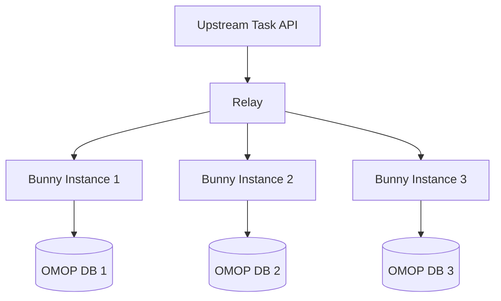

# hutch_relay_wiki

## How Hutch Bunny Works with Relay

Hutch Bunny and Relay work together in a federated network architecture where Relay acts as a central coordinator and Bunny instances serve as distributed query executors. Here's how they interact:

### Architecture Overview



### Communication Flow

1. Relay receives queries from an upstream Task API (like HDR Cohort Discovery)

2. Relay distributes these queries to configured Bunny instances

3. Each Bunny:

   - Executes the query against its local OMOP database

   - Applies configured obfuscation rules

   - Returns results to Relay

4. Relay aggregates results and returns them upstream

### Configuration Example

#### Bunny Configuration for Relay

To connect Bunny to Relay, configure these environment variables:

```yaml
# bunny-standalone.compose.yml
services:
  bunny:
    environment:
      # Relay connection settings
      TASK_API_BASE_URL: http://relay:8080
      TASK_API_USERNAME: username  # Credentials from Relay user setup
      TASK_API_PASSWORD: password
      COLLECTION_ID: collection_id # SubNode ID from Relay
      POLLING_INTERVAL: 5 # Seconds between polling

      # Database connection
      DATASOURCE_DB_USERNAME: postgres
      DATASOURCE_DB_PASSWORD: postgres
      DATASOURCE_DB_DATABASE: postgres
      DATASOURCE_DB_DRIVERNAME: postgresql
      DATASOURCE_DB_SCHEMA: public
      DATASOURCE_DB_PORT: 5432
      DATASOURCE_DB_HOST: db

      # Optional obfuscation settings
      LOW_NUMBER_SUPPRESSION_THRESHOLD: 10
      ROUNDING_TARGET: 5
```

#### Message Examples

##### 1\. Availability Query

When Relay sends an availability query to Bunny:

```json
{
  "task_id": "job-2023-01-13-14:20:38-project",
  "project": "project_id",
  "owner": "user1",
  "cohort": {
    "groups":
      {
        "rules":
          {
            "varname": "OMOP",
            "varcat": "Person",
            "type": "TEXT",
            "oper": "=",
            "value": "8507"
          }
        ],
        "rules_oper": "AND"
      }
    ],
    "groups_oper": "OR"
  },
  "collection": "collection_id",
  "protocol_version": "v2",
  "char_salt": "salt",
  "uuid": "unique_id"
}
```

##### 2\. Bunny Response

Bunny responds with results in this format:

```json
{
  "uuid": "unique_id",
  "status": "success",
  "collection_id": "collection_id",
  "count": 150,  // Obfuscated if configured
  "datasets_count": 1,
  "files":
  "message": "",
  "protocol_version": "v2"
}
```

### Setup Process

1. Deploy Relay in a central location

2. Create a user and SubNode in Relay:

```bash
docker run \
--network=host \
-e ConnectionStrings__Default="Server=localhost;Port=5432;Database=hutch-relay;User Id=postgres;Password=postgres" \
ghcr.io/health-informatics-uon/hutch/relay:dev-latest \
users add demo1
```

1. Configure each Bunny instance with:

   - Relay's base URL

   - Generated username and password

   - Assigned SubNode ID

   - Local OMOP database connection details

2. Start Bunny daemon:

```bash
docker compose -f bunny-standalone.compose.yml up
```

### Security Considerations

1. Bunny only makes outbound connections to Relay

2. Each Bunny instance requires unique credentials

3. Results can be obfuscated before leaving Bunny:

   - Low number suppression

   - Rounding to nearest N

4. Sensitive data remains within local environment

### Monitoring

When running correctly, Bunny logs will show:

```sh
INFO - Setting up database connection…
INFO - Looking for job…
INFO - Job received. Resolving…
INFO - Processing query…
INFO - Solved availability query
INFO - Job resolved.
```

This indicates successful:

- Database connection

- Communication with Relay

- Query processing

- Result transmission