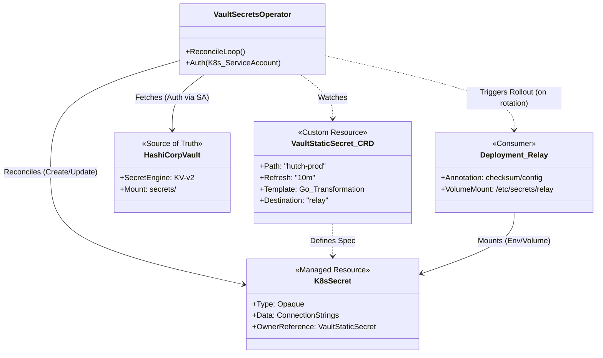

## Executive Summary

The `hie-prod-34` deployment manages secrets using **HashiCorp Vault** integrated via the **Vault Secrets Operator (VSO)**. Secrets are **not** stored in the Git repository (neither encrypted nor plain). Instead, the Helm deployment creates `VaultStaticSecret` custom resources that instruct the operator to fetch secrets from a running Vault instance and project them into standard Kubernetes `Secret` objects.

## Architecture Patterns

1.  **Source of Truth**: An external HashiCorp Vault instance.
    -   **Vault Namespace**: `admin/deployments/hie-prod-34`
    -   **Vault Mount**: `secrets`
    -   **Vault Path**: `hutch-prod` (defined in `hutch_prod_values.yaml`)

2.  **Delivery Mechanism**: [Vault Secrets Operator](https://developer.hashicorp.com/vault/docs/platform/k8s/vso)
    -   The Helm chart renders `VaultStaticSecret` Custom Resource Definitions (CRDs).
    -   The VSO controller watches these CRDs, authenticates with Vault, fetches the data, applies transformations (templates), and creates/updates Kubernetes `Secrets`.

3.  **Consumption**:
    -   Applications (Relay, Bunny, PostgreSQL, RabbitMQ) are configured to use the *generated* Kubernetes Secrets.
    -   They are unaware of Vault; they simply mount standard secrets referenced by name (e.g., `relay`, `bunny`).

## Implementation Details

### 1. Configuration (`ffnodes`)

The definition resides in `ffnodes/eoe/hie-prod-34/hutch_prod_values.yaml`. It uses the `extraDeploy` key to inject raw Kubernetes resources into the chart.

**Example: Relay Secret Definition**

```yaml
extraDeploy:
  - apiVersion: secrets.hashicorp.com/v1beta1
    kind: VaultStaticSecret
    metadata:
      name: relay
    spec:
      namespace: admin/deployments/hie-prod-34
      path: hutch-prod
      destination:
        create: true
        name: relay  # The resulting K8s specific name
        transformation:
          templates:
            # Maps Vault data to K8s Secret keys
            db_connection_string:
              text: 'Host=hutch-prod-postgresql;...;User Id={{`{{get .Secrets "relay_postgresql_username"}}`}};...'
```

### 2. Chart Logic (`charts/hutch`)

The `hutch` chart facilitates this via:

1.  **`templates/extra-deploy.yaml`**: Iterates over the `extraDeploy` values list and renders each item as a manifest. This allows the `ffnodes` repo to define arbitrary VSO resources without the chart needing explicit VSO support.
2.  **`templates/relay-secret.yaml`**: Contains logic to *skip* creating the default insecure/Helm-managed secrets if `existingSecretName` is provided in values.

    ```yaml
    {{- if ... .Values.relay.db.auth.existingSecretName ... -}}
    # Secret creation is skipped because external secret is used
    {{- else -}}
    apiVersion: v1
    kind: Secret
    ...
    {{- end -}}
    ```

### 3. Application Configuration

The applications are pointed to the secrets created by VSO:

```yaml
# hutch_prod_values.yaml
relay:
  db:
    auth:
      existingSecretName: "relay" # Matches 'destination.name' in VaultStaticSecret
```

## Secret Inventory

| Application | Vault Source Key | K8s Secret Name | Keys Created |
| :--- | :--- | :--- | :--- |
| **Relay** | `relay_*` | `relay` | `db_connection_string`, `rabbitmq_connection_string`, `upstream_task_api_username`, `upstream_task_api_password` |
| **Bunny** | `bunny_*` | `bunny` | `db_username`, `db_password`, `task_api_username`, `task_api_password` |
| **Postgres** | `postgres_admin_password` | `hutch-postgresql` | `postgres-password` |
| **RabbitMQ** | `rabbitmq_admin_password`, `rabbitmq_erlang_cookie` | `hutch-rabbitmq` | `rabbitmq-password`, `rabbitmq-erlang-cookie` |
| **Users** | `cuhbunny1_password` | `relay-downstream-users` | `cuhbunny1_password` |

## Summary of Flow

1.  **Helm Install/Upgrade**: Applies `VaultStaticSecret` manifests (from `extraDeploy`).
2.  **VSO Controller**: Sees `VaultStaticSecret`, calls Vault API at `admin/deployments/hie-prod-34/hutch-prod`.
3.  **Transformation**: VSO extracts fields (e.g., `relay_postgresql_password`) and constructs the connection strings defined in `templates`.
4.  **K8s Secret**: VSO creates a Secret named `relay` in the namespace.
5.  **Pod Startup**: The `relay` pod starts, looks for a secret named `relay` (via `existingSecretName`), mount it, and connects to the DB.

## Recommendations / Notes
-   **Debug**: If secrets are missing, check the status of the `VaultStaticSecret` resource: `kubectl get vaultstaticsecret relay -o yaml` inside the cluster. It will show sync status and errors.
-   **Rotation**: The configuration includes `refreshAfter: 10m` and `rolloutRestartTargets`, meaning if secrets change in Vault, VSO updates the K8s secret and restarts the Deployments automatically.

## Dependency Diagram


