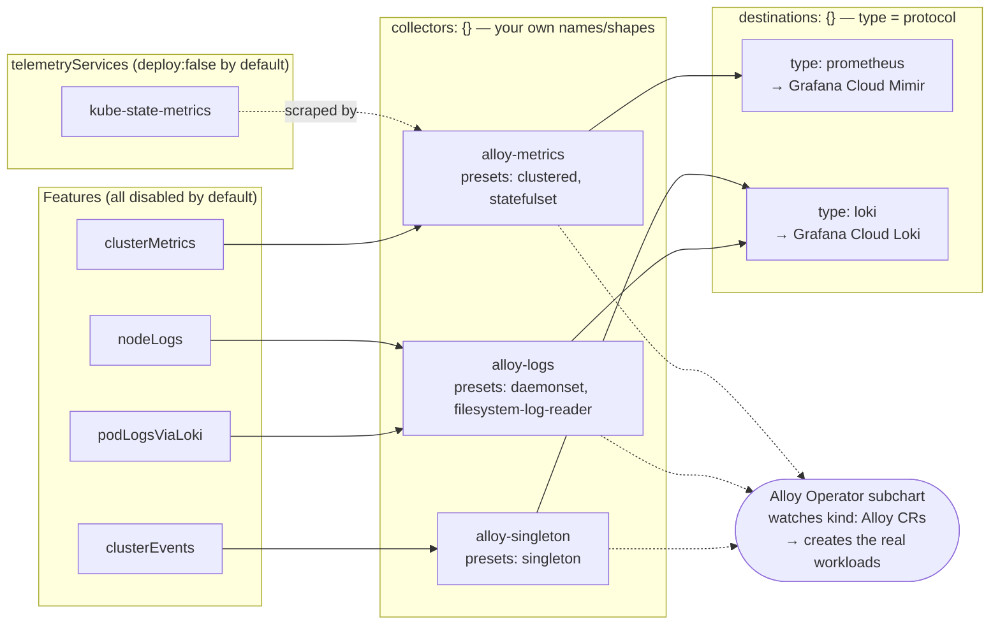

## grafana/k8s-monitoring-helm—Deep Analysis

Context: Grafana Cloud backend, multi-cluster delivery via ArgoCD GitOps, signals in scope now = cluster metrics, cluster events, pod logs, node logs (app observability / cost / profiling later). Platform: mixed/on-prem.

### Version Pinned

| | |
|---|---|
| Chart analysed | `charts/k8s-monitoring` (current). `charts/k8s-monitoring-v1` (legacy) was not touched. |
| Chart version / appVersion | `4.1.6` / `4.1.6`—`charts/k8s-monitoring/Chart.yaml:9-10` |
| Alloy Operator subchart | `0.5.10`, from `https://grafana.github.io/helm-charts`—`Chart.yaml:106-109`, `Chart.lock:56-58` |
| Alloy Helm chart / Alloy binary behind that operator version | `1.10.0` / `1.17.0`—`docs/Versions.md:69` |
| Line | v4—`destinations` is a map, `collectors` is a map. Confirmed directly in `values.yaml:67` (`destinations: {}`) and `values.yaml:452` (`collectors: {}`), and in the rendering logic (`templates/collectors/_collector_helpers.tpl`, `templates/destinations/_destination_helpers.tpl`). |

Critical correction before anything else: this repository's own `charts/k8s-monitoring/AGENTS.md` (written for AI assistants) and `docs/Value-ValueKey-ValueFrom.md` are internally stale—both show v3-era list-syntax `destinations: [{name: …}]` and assume fixed collector names (`alloy-metrics`, `alloy-logs`, `alloy-receiver`, `alloy-singleton`, `alloy-profiles`). Neither is true in 4.1.6. Source of truth is `values.yaml` + `README.md`'s "Breaking change announcements" + the templates themselves, not those two docs.

---

### Phase 1—Repository Cartography

```
charts/k8s-monitoring/                       (v4.1.6 — the chart to use)
├── Chart.yaml / Chart.lock                  18 feature-chart deps (all 1.0.0) + telemetry-services (1.0.0) + alloy-operator (0.5.10)
├── values.yaml                              615 lines: cluster, global, destinations{}, <feature>.{enabled,destinations,collector}, collectors{}, collectorCommon, telemetryServices, alloy-operator, replaceComponent, extraObjects
├── values.schema.json                       102KB JSON Schema validation contract
├── AGENTS.md(.gotmpl)                       AI-assistant guide — PARTIALLY STALE, see above
├── README.md(.gotmpl)                       generated by helm-docs; breaking-changes log v1→v4, quick-start, full values reference
├── CHANGELOG.md                             confirms the 4.0.0 entries match the README breaking-changes section
├── collectors/
│   ├── alloy-values.yaml                    chart's own Alloy defaults (security context, no resources, configMap.create:false, crds.create:false)
│   ├── presets/                             clustered, daemonset, deployment, statefulset, singleton, privileged, filesystem-log-reader, small/medium/large/xlarge
│   └── upstream/alloy-values.yaml            vendored copy of upstream grafana/alloy chart defaults — used only by validation logic, not in the rendered CR
├── destinations/                            per-type defaults: custom, loki, loki-stdout, otlp, prometheus, pyroscope -values.yaml (NOT live examples — merge-defaults, no grafana.net placeholders)
├── default-remove-lists/resource-attributes.yaml   OTLP-only resource-attribute drop list
├── charts/
│   ├── feature-*/                           17 feature subcharts, 1:1 with values.yaml top-level feature keys
│   ├── telemetry-services/                  wraps kube-state-metrics, node-exporter, windows-exporter, kepler, opencost, k8s-manifest-tail
│   └── alloy-operator-0.5.10.tgz            vendored; bundles `alloy-crd` (CRD-only chart, ships CRD via Helm's special crds/ folder) + `podlogs-crd`
├── templates/                               alloy.yaml (Alloy CR), alloy-config.yaml (ConfigMap), destinations/, collectors/, features/ helpers, validations
├── docs/                                    MOSTLY auto-generated; many top-level .md files are stub redirects to grafana.com — docs/examples/ (34 dirs) are real, CI-tested configs
└── tests/                                   helm-unittest + integration tests, several with .rendered/ output snapshots

allowLists/                                   REPO ROOT, NOT inside charts/k8s-monitoring — build-time source files, copied by each feature chart's own Makefile into a local default-allow-lists/ dir; not read directly by Helm at render time
```

How it's composed: `k8s-monitoring` is an umbrella chart. You describe _what_ to monitor (`<feature>.enabled`) and _where_ to send it (`destinations` map); the chart resolves each enabled feature onto a _collector_ (a Grafana Alloy instance you define under the free-form `collectors` map) and renders that collector's full Alloy configuration as a ConfigMap plus a `kind: Alloy` custom resource. A separate bundled subchart, the Alloy Operator, watches those CRs and turns them into real Deployments/DaemonSets/StatefulSets. Optional supporting workloads (kube-state-metrics, Node Exporter, OpenCost, Kepler, Windows Exporter, k8s-manifest-tail) live in the `telemetry-services` subchart—they _supply_ data for Alloy to scrape, they don't ship data themselves.

---

### Phase 2—Architecture & Data Flow

#### The Four Pillars (And oNe cOrrection to the sTandard mEntal mOdel)

| Pillar | What changed in v4 |
|---|---|
| `cluster.name` / `cluster.nameFrom` | Unchanged—a label applied to all telemetry (`values.yaml:3-11`). |
| `destinations` | Map, keyed by your own name. `type` = delivery protocol (`prometheus`, `loki`, `loki-stdout`, `otlp`, `pyroscope`, `custom`)—full list confirmed at `templates/destinations/_destination_types.tpl:2-9`. |
| `features` | All disabled by default (`enabled: false` on every feature block in `values.yaml`). |
| `collectors` | Map with arbitrary keys—`values.yaml:452` (`collectors: {}`). There is no such thing as a fixed "alloy-metrics" instance baked into the chart. `alloy-metrics`/`alloy-logs`/`alloy-singleton`/`alloy-receiver`/`alloy-profiles` are just the naming convention used consistently across the repo's own examples (`README.md:279-282`, `docs/examples/scalability/*`, `docs/examples/deployment-alternatives/argocd/*`)—confirmed by reading `templates/collectors/_collector_helpers.tpl:209-216`, which lists enabled collectors purely from `keys(.Values.collectors)`. Shape is determined entirely by `presets:` (`collectors/presets/*.yaml`). |

#### The Alloy Operator Model

- The parent chart, not the operator, builds the Alloy configuration: `templates/alloy-config.yaml` renders the full Alloy/River config as a ConfigMap; `templates/alloy.yaml` renders the matching `kind: Alloy` (`apiVersion: collectors.grafana.com/v1alpha1`) CR per enabled collector.
- The Alloy Operator (vendored subchart, `alloy-operator-0.5.10.tgz`) watches those CRs and is the actual controller that creates the Deployment/DaemonSet/StatefulSet workload, replacing the pre-v3.0 model where Helm hooks deployed Alloy directly (a model abandoned because it broke under ArgoCD/upgrades—`README.md:201-214`).
- Feature → collector assignment (`templates/collectors/_collector_helpers.tpl:189-201`, `collectors.getCollectorForFeature`): (1) explicit `<feature>.collector: "name"` if set → (2) feature's own `chooseCollector` override (none of the in-scope features define one) → (3) if exactly one collector is enabled cluster-wide, use it → (4) otherwise unresolved, and `collectors.validate.collectorIsAssigned` fails the render. Practical rule: the moment you define more than one collector, every feature needs an explicit `collector:` field.
- Non-obvious default-shape footgun: if a collector has zero presets, its `controller.type` inherits the _upstream_ Alloy chart's own default, which is `daemonset` (confirmed via `_collector_validations.tpl`'s clustering check, which reads the upstream-merged default). A daemonset metrics-collector with clustering off means every node's pod scrapes the entire cluster independently → duplicate series. This is why every example in the repo explicitly sets `presets: [clustered, statefulset]` (or `deployment`/`singleton`) for anything that isn't a log-tailing DaemonSet. Never leave a collector preset-less.

#### Destination-assignment Algorithm

`templates/destinations/_destination_helpers.tpl:3-30` (`destinations.get`):

1. For a feature's required signal type, filter destinations to ones whose type `supports_<signal>`.
2. If the feature did not set an explicit `destinations: […]` override: group survivors by whether their type's `ecosystem` string (e.g. `prometheus`, `loki`, `otlp`, `pyroscope`) matches what the feature is looking for; ecosystem matches win, non-matches are only used as a fallback if no match exists.
3. If the feature did set `destinations: […]`: only those named destinations are used, no ecosystem logic at all.

For your setup specifically: with exactly one `prometheus`-type and one `loki`-type destination, there is never a competing candidate. Every metrics-capable feature (`clusterMetrics`) lands on the one Prometheus destination and every logs-capable feature (`clusterEvents`, `nodeLogs`, `podLogsViaLoki`) lands on the one Loki destination automatically—you do not need to set `destinations: […]` on any feature today. That only starts mattering once you add a second destination of the same capability (e.g. a second Prometheus target) or an `otlp` destination later for traces.

#### Architecture Diagram (Corrected for yOur iN-scope sIgnals)



#### Per-signal Pipeline (Discover → cOllect → pRocess → dEliver)

| Signal | Discover | Collect | Process (cardinality levers live here) | Deliver |
|---|---|---|---|---|
| Cluster metrics | `discovery.kubernetes` (role: node), kube-state-metrics Service | `prometheus.scrape` per source (kubelet/cAdvisor/KSM/control-plane) | per-source `metricsTuning.{useDefaultAllowList,includeMetrics,excludeMetrics}`, `extraDiscoveryRules`/`extraMetricProcessingRules`, `global.maxCacheSize` | `prometheus.remote_write` → matched `prometheus` destination, with `queue_config`/`wal` tuning |
| Cluster events | K8s Events API watch (`loki.source.kubernetes_events`) | single watcher component (not per-node) | `includeReasons`/`excludeReasons`, `includeLevels`/`excludeLevels`, `namespaces`/`excludeNamespaces`, `labels` (indexed!) vs `structuredMetadata` (cheap) | `loki.write` → matched `loki` destination |
| Node logs | systemd journal only, via hostPath `/var/log/journal` on each DaemonSet pod | `loki.source.journal` | `journal.units` allow-list, `journalLabels` vs `structuredMetadata` | `loki.write` |
| Pod logs (via Loki) | pod discovery (namespaces/labelSelectors/`discoveryMethod: all\|annotation`) | hostPath tail of `/var/log/containers` (+ optionally `/var/lib/docker/containers`), CRI/Docker parsing | `labels`/`annotations` mapping (indexed) vs `structuredMetadata`, `secretFilter` (redaction, experimental) | `loki.write` |

---

### Phase 3—Component Inventory

| Component | What it does | Telemetry | Values key(s) | Default | Resource profile | Gotchas |
|---|---|---|---|---|---|---|
| Grafana Alloy (your collectors) | Collection/processing/delivery agent—one or more user-defined instances | n/a (the pipe) | `collectors.<name>.*` + `presets` | At least one collector required (validated) | `alloy.resources: {}` (none) until a `small`/`medium`/`large`/`xlarge` preset or manual value is set—`collectors/alloy-values.yaml` | No-preset collectors default to DaemonSet (see Phase 2); DaemonSet+log presets need hostPath/privilege; clustered+StatefulSet needed for sharded metrics HA |
| Alloy Operator | Operator turning `kind: Alloy` CRs into real workloads | n/a | `alloy-operator.*` | `deploy: true` (`values.yaml:509`); CRD install `deployAlloyCRD: true` (extracted subchart `values.yaml:231`) | not surfaced by parent chart | Ships its CRD via Helm's special `crds/` folder (`alloy-crd` subchart)—plain `helm template` does not render `crds/` without `--include-crds`; this is the real ArgoCD ordering risk |
| kube-state-metrics | K8s object-state metrics | metrics | `telemetryServices.kube-state-metrics.deploy`, `clusterMetrics.kube-state-metrics.*` | `deploy: false` | not set by this chart | `autosharding: false`, `updateStrategy: Recreate` (avoids dup metrics on rollout); pinned subchart `7.5.1` / image `v2.19.1` |
| Node Exporter | Linux host metrics | metrics | `telemetryServices.node-exporter.deploy`, `hostMetrics.linuxHosts.*` | `deploy: false` (chart overrides the subchart's own `true` default) | not set | upstream sets `hostNetwork: true`, `hostPID: true`; chart adds a `portConflictCheck` guard; pinned `4.55.0` / `v1.11.1` |
| Windows Exporter | Windows host metrics | metrics | `telemetryServices.windows-exporter.deploy`, `hostMetrics.windowsHosts.*` | `deploy: false` | not set | restricted collector set (`cpu,container,logical_disk,memory,net,os`); pinned `0.12.7` / `0.31.7` |
| kubelet / cAdvisor scraping | In-process scrape targets (no separate workload) | metrics | `clusterMetrics.kubelet.*`, `.cadvisor.*` | both `enabled: true` once `clusterMetrics.enabled: true` | n/a | `nodeAddressFormat: direct\|proxy`; richest set of cardinality levers in the chart |
| OpenCost | Cost-allocation metrics | metrics | `telemetryServices.opencost.deploy`, `costMetrics.opencost.*` | `deploy: false` | not set | Needs an independently-configured query-capable Prometheus endpoint (`prometheus.external.url`), separate from `destinations`—easy to forget; GKE non-root `/var/configs` workaround built in; pinned `2.5.23` / `1.120.3` |
| Kepler | eBPF energy/power metrics | metrics | `telemetryServices.kepler.deploy`, `hostMetrics.energyMetrics.*` | `deploy: false` | not set | likely needs elevated host access upstream (not independently re-verified this pass); pinned `0.6.1` / `release-0.8.0` |
| Beyla (`feature-auto-instrumentation`) | eBPF zero-code instrumentation | metrics, traces | `autoInstrumentation.*` | `enabled: false` |—| needs `hostPID`/`hostNetwork`/`hostPorts`/privileged/hostDir volumes—confirmed via the OpenShift SCC manifest (`charts/feature-auto-instrumentation/templates/platform_specific/openshift/beyla-scc.yaml`) |
| Beyla k8s-cache | Shared K8s metadata cache so DaemonSet Beyla pods don't all hit the API server | n/a (sidecar service) | `autoInstrumentation.k8sCache.*` | `replicas: 1` ("1 per 50 nodes" guideline) | requests `0.1 CPU` / `256Mi`—`charts/feature-auto-instrumentation/values.yaml:52-62` | confirmed real |
| k8s-manifest-tail | Watches/logs K8s manifest changes (experimental) | logs | `telemetryServices.k8s-manifest-tail.deploy`, `kubernetesManifests.*` | `deploy: false` | not set | experimental; needs manual OTLP-logs-endpoint wiring; pinned `0.1.5` / `0.1.2` |
| Config-reloader sidecar | Watches each Alloy pod's mounted ConfigMap and triggers Alloy to reload its config without a pod restart | n/a (sidecar, not a telemetry source) | `collectors.<name>.alloy.configReloader.*` / `collectorCommon.alloy.configReloader.*` (image, resources, securityContext, customArgs) | `enabled: true` by default, present on every collector unless explicitly disabled | requests `10m CPU` / `50Mi` memory, no limits set—`collectors/upstream/alloy-values.yaml:198-220` | Correction (2026-06-25): an earlier pass of this table wrongly marked this row "not found." It's the Prometheus Operator's own config-reloader (`quay.io/prometheus-operator/prometheus-config-reloader`), reused as-is by the upstream Alloy chart. It pulls from a separate registry (`quay.io`) from Alloy's own image—easy to miss when mirroring images to a private registry, since fixing only `alloy.image.registry` leaves this container still pulling from the public registry. |

---

### Phase 4—Feature Configuration Guide

#### In Scope now (Deep)

##### `clusterMetrics`

- Purpose: kubelet, cAdvisor, kube-state-metrics, optional control-plane metrics.
- Destination: metrics (`prometheus`/`otlp`).
- No DaemonSet/privilege needed—kubelet/cAdvisor are scraped over the network per node, the collector doesn't need to physically run on that node.
- Repeated cardinality-lever pattern, present on 9 separate sources (`kubelet`, `kubeletResource`, `kubeletProbes`, `cadvisor`, `kube-state-metrics`, `apiServer`, `kubeControllerManager`, `kubeDNS`, `kubeProxy`, `kubeScheduler`—`charts/feature-cluster-metrics/values.yaml`):

| Key (per source) | Default | Lever |
|---|---|---|
| `<source>.metricsTuning.useDefaultAllowList` | `true` | curated allow-list ships in `default-allow-lists/` |
| `<source>.metricsTuning.includeMetrics` / `excludeMetrics` | `[]` / `[]` | manual keep/drop regex |
| `<source>.maxCacheSize` | unset → falls back to `global.maxCacheSize` (100000) | `prometheus.relabel` cache sizing |
| `<source>.extraDiscoveryRules` / `extraMetricProcessingRules` | `""` | raw relabel escape hatches |

- cAdvisor-specific extras (highest-value levers in the whole chart): `dropEmptyContainerLabels`/`dropEmptyImageLabels` (both `true`), `normalizeUnnecessaryLabels` (`true`), `keepPhysicalFilesystemDevices`/`keepPhysicalNetworkDevices` (curated regex, drops loopback/virtual devices), `includeNamespaces`/`excludeNamespaces`.
- `kube-state-metrics.discoveryType` (default `endpoints`) and `namespaces`/`namespacesDenylist` matter a lot at scale.
- Soft dependency, not a Helm chart dependency: if `telemetryServices.kube-state-metrics.deploy: true`, the feature auto-fills namespace/label selectors; otherwise you must set `clusterMetrics.kube-state-metrics.namespace`/`.labelMatchers` to point at an existing KSM.
- Worked tuning example: `docs/examples/metrics-tuning/` (truth table for `useDefaultAllowList × includeMetrics × excludeMetrics`).

##### `clusterEvents`

- Purpose: streams the Kubernetes Events API as Loki-format logs (single watcher, not per-node).
- Destination: logs only.
- Collector requirement is a convention, not enforced: this is the only feature whose own README explicitly recommends a singleton collector ("the feature should run on a singleton collector"—`charts/feature-cluster-events/values.yaml:21`), but this chart has no `_collector_validation.tpl`—unlike the log features below, nothing stops you misconfiguring it.
- Key levers: `namespaces`/`excludeNamespaces`, `includeReasons`/`excludeReasons` (high value—events are noisy/high-volume), `includeLevels`/`excludeLevels`, and critically `labels` (default `{reason: reason}`, indexed) vs `structuredMetadata` (default `{name, node}`, cheap)—keep `labels` minimal, anything per-object (pod name, node) belongs in `structuredMetadata`.
- `clustering: false` by default; if you set it `true`, the _assigned collector_ must independently have clustering enabled too—unvalidated mismatch risk.

##### `nodeLogs`

- Correction to the obvious assumption: despite the name, this is journal-only (`loki.source.journal`)—not a generic node-file reader.
- Hard-enforced collector requirements (`_collector_validation.tpl`, render fails otherwise): `controller.type: daemonset`, and `alloy.mounts.varlog: true` (i.e. the `filesystem-log-reader` preset, or manual).
- Key lever: `journal.units` (allow-list, e.g. `[kubelet.service]`)—journal logs are very noisy by default. `unit`/`service_name` Loki labels are always set regardless of config—a fixed, non-optional cardinality cost (one series per distinct systemd unit per node).

##### `podLogsViaLoki`

- Purpose: tails `/var/log/containers/*.log` (+ optionally `/var/lib/docker/containers`), CRI/Docker-format parsing, Loki output. Matches your Grafana Cloud Loki destination with zero protocol translation.
- Hard-enforced: `controller.type: daemonset` + `alloy.mounts.varlog: true`; if `secretFilter.enabled`, the collector's `alloy.stabilityLevel` must be `experimental`.
- Best cost lever in this feature: `discoveryMethod: all` (default) vs `annotation`—switching to annotation-gated opt-in discovery (`logs.grafana.com/pods.enabled`) is the recommended way to avoid paying for every namespace's logs by default.
- `onlyGatherNewLogLines` defaults to `true` (changed in v4 specifically to avoid replay storms on Alloy restart—pair with collector-storage for log-position persistence if you need to not miss early logs).
- Same `labels`/`annotations` (indexed) vs `structuredMetadata` (cheap) trade-off as the other log features—`k8s.pod.name`/`pod`/`service.instance.id` ship in `structuredMetadata` by default, correctly.

#### Lower Priority for now (Brief)

| Feature | One-liner | Destination | Collector note |
|---|---|---|---|
| `podLogsViaOpenTelemetry` | Same filesystem discovery as `podLogsViaLoki`, OTLP-format output instead | otlp (logs) | Same DaemonSet+varlog requirement, plus requires `alloy.stabilityLevel: public-preview` or `experimental` (less mature than the Loki path)—stick with `podLogsViaLoki` for a Loki destination |
| `podLogsViaKubernetesApi` | Streams pod logs via the K8s API server—no hostPath/DaemonSet/privilege at all | loki | Requires clustering instead (to avoid duplicate API-server log streaming across replicas)—good fit for Fargate-style or restrictive-PSP nodes |
| `podLogsObjects` | PodLogs CRD-object-driven discovery (declarative, GitOps-friendly) | loki | Requires clustering under the same replica conditions; requires DaemonSet only if `nodeFilter: true` |
| `hostMetrics` | Node Exporter (`linuxHosts`)/Windows Exporter (`windowsHosts`)/Kepler (`energyMetrics`) | prometheus | n/a—telemetryServices-backed |
| `costMetrics` | OpenCost | prometheus | n/a |
| `annotationAutodiscovery` | Pod/Service-annotation-driven scraping | prometheus | n/a |
| `applicationObservability` / `autoInstrumentation` | OTLP-receiving / Beyla eBPF instrumentation | metrics+logs+traces | needs a receiver collector with extra ports open |
| `profiling` / `profilesReceiver` | Continuous profiling | pyroscope | n/a |
| `prometheusOperatorObjects` | ServiceMonitor/PodMonitor/Probe scraping | prometheus | CRDs no longer bundled—install `prometheus-operator-crds` separately first |
| `integrations` | Curated scrape configs for alloy/cert-manager/dcgm-exporter/etcd/grafana/istio/loki/mimir/mysql/postgresql/tempo | prometheus | n/a |
| `kubernetesManifests` | Experimental manifest-change logging via `k8s-manifest-tail` | logs | n/a |

---

### Phase 5—Best Practices

#### 1. Cardinality & Cost Control (The 1 lEver)

- Every metrics source in `clusterMetrics` follows the same 4-lever shape (`metricsTuning.useDefaultAllowList/includeMetrics/excludeMetrics`, `maxCacheSize`, raw relabel escape hatches)—use the shipped allow-lists first, then narrow with `excludeMetrics`/namespace filters before reaching for raw relabel rules.
- `global.maxCacheSize` (default `100000`) feeds every `prometheus.relabel` component's `max_cache_size`; per-source overrides exist but the "2-5x largest scrape target" sizing guidance is documentation only—not enforced by any validation.
- Logs: the recurring `labels` (indexed in Loki) vs `structuredMetadata` (not indexed) choice across `clusterEvents`/`nodeLogs`/`podLogsViaLoki` is the single biggest log-cost lever—only put fields you'll actually filter/group by in `{}`-selectors into `labels`.
- Footgun—unenforced dependency: `global.scrapeNativeHistograms` / `global.convertClassicHistogramsToNhcb` / destination `sendNativeHistograms` / destination `remoteWriteProtocol: 2` are documented as interdependent (NHCB requires native-histogram scraping + Remote Write v2 + the destination flag) but nothing in the chart validates this combination—get any one wrong and histograms silently fail to land, with no render-time warning.
- OTLP-only: a default resource-attribute removal list (`process.*`, `host.ip`/`host.mac`, etc.) exists at `default-remove-lists/resource-attributes.yaml`, applied only inside the `otlp` destination template—not relevant to the Prometheus/Loki setup today, but worth knowing if traces are added later.

#### 2. Collector Sizing & HA

- `clustered` preset shards scrape targets across replicas via Alloy's gossip clustering—pair with `statefulset` (every repo example does; never with bare `deployment`) for stable peer identity.
- `singleton` preset = `deployment`, `replicas: 1`—for non-shardable work (cluster events by convention).
- Sizing presets (`small`/`medium`/`large`/`xlarge`) set requests/limits only; there's no default (`alloy.resources: {}`), so an un-sized collector runs unconstrained.
- Remote-write queue/WAL tuning lives on the destination, not the collector (`destinations.<name>.queueConfig.*` / `.writeAheadLog.*`, defaults: capacity 10000, 1-50 shards, 2000 samples/send, 2h WAL truncate)—a non-obvious split worth remembering when troubleshooting backpressure.
- KSM scaling footgun: changing kube-state-metrics replica count requires deleting its Service first (in-place updates break sharding)—`docs/examples/scalability/sharded-kube-state-metrics/README.md`.
- Istio mesh footgun: if the namespace is Istio-injected and a clustered collector's clustering port name starts with `http` (the default), Istio's L7 routing breaks headless-Service peer discovery → duplicate metrics from un-clustered replicas. Fix: `alloy.clustering.portName: tcp`. (`docs/examples/istio-service-mesh`, detected live by a chart-rendered NOTES.txt warning via a `lookup` of namespace labels.)

#### 3. Destinations & Secrets

- Three secret modes exist on every destination: literal (`auth.password`, chart auto-creates the Secret), external (`secret.create: false` + `auth.passwordKey` pointing into a Secret you manage), and `…From` (raw Alloy expression, e.g. `sys.env(…)`). Never inline credentials in git-tracked values for GitOps—use the external mode with an External Secrets Operator / Sealed Secrets / your existing secret pipeline.
- Grafana Cloud is not a distinct destination type—it's reached with ordinary `prometheus` (Mimir remote-write) + `loki` destinations using `auth.type: basic` (username = stack/instance ID, password = Cloud Access Policy token). Confirmed: there's no `grafana.net`-specific constant anywhere in the chart; get the exact push URLs and instance ID from the Grafana Cloud stack's connection details page.
- Single OTLP backend vs split LGTM: not relevant to the current scope (split Prometheus+Loki today), but if traces are added, note `otlp` reports its own `ecosystem` string distinct from `prometheus`/`loki`—it won't silently merge with existing destinations.

#### 4. GitOps / ArgoCD

- The chart's own CRD pre-flight check is real and strict (`templates/_crd-validation.tpl`): on install, if the Alloy CRD API isn't visible and `alloy-operator.crds.deployAlloyCRD` isn't true, render fails with explicit instructions; on upgrade, it always fails if the CRD API isn't visible, full stop.
- The actual CRD-ordering risk for the ArgoCD delivery model: the Alloy CRD ships inside the `alloy-operator` subchart's `alloy-crd` dependency using Helm's special `crds/` directory convention. Plain `helm template` (what ArgoCD's repo-server uses to render Helm sources) does not render `crds/` contents unless `--include-crds` is passed. Modern ArgoCD defaults to passing it for Helm sources, but this is an ArgoCD-version/config behaviour, not something this chart controls—verify it explicitly rather than assuming.
- There is a first-party, CI-tested ArgoCD example in this repo: `docs/examples/deployment-alternatives/argocd/` (`Application`, `Application` + External Secrets, and `ApplicationSet` variants). Key patterns worth lifting directly:
  - `collectorCommon.alloy.annotations: {argocd.argoproj.io/sync-wave: "1"}` pushes every Alloy CR to wave 1, after the implicit wave-0 CRD/operator install.
  - Three named collectors used throughout: `alloy-metrics` (`clustered, statefulset`), `alloy-logs` (`filesystem-log-reader, daemonset`), `alloy-singleton` (`singleton`)—exactly matching the in-scope signals here.
  - Use ArgoCD's `values:` (multiline string) field, not `valuesObject`, if you ever need to null out a chart default—`valuesObject` can't express YAML `null` ([argo-cd#16312](https://github.com/argoproj/argo-cd/issues/16312), cited in-repo).
  - `ApplicationSet` cluster-generator name-collision footgun, directly relevant to a multi-cluster model: cluster names `prod_us` and `prod-us` both normalize to `prod-us` and collide—pick a strict naming convention up front.
- The `--take-ownership` flag mentioned in the README is a one-time v3.3→v3.4 migration step (Alloy briefly deployed via Helm hooks, since abandoned)—not relevant to a fresh v4.1.6 install.
- `values.schema.json` is present and can be validated in CI pre-merge (e.g. `helm template --validate` / `ajv` against the schema) before ArgoCD ever sees the rendered manifests.

#### 5. Multi-cluster

- Set `cluster.name` per cluster—for an `ApplicationSet` cluster-generator, template it from the generator's own cluster name/label rather than hardcoding per overlay.
- Shared Grafana Cloud destination across all clusters is fine and is exactly what the ecosystem-matching algorithm is designed for; per-cluster differences belong in `collectors`/`telemetryServices` sizing, not `destinations`.

#### 6. Security

- DaemonSet log collectors need `varlog`/`dockercontainers` hostPath mounts (`filesystem-log-reader` preset)—not full `privileged` (that preset is separate, for things like Beyla's eBPF needs, not basic log tailing).
- Node Exporter needs `hostNetwork`+`hostPID` upstream; OpenShift platform support is handled via `global.platform: openshift` (auto-detected) plus dedicated SCC manifests for Beyla.
- `global.namespaceOverride` scopes all chart-created resources into one namespace if you don't want chart-managed RBAC spanning multiple namespaces.

#### 7. Upgrades

- `docs/Versions.md` is the authoritative Alloy/Alloy-Operator version-pin table per chart release—check it before bumping.
- The official v3→v4 values migrator: <https://github.com/grafana/k8s-monitoring-helm-migrator> (cited directly in `README.md:14`).
- `Chart.lock` pins every dependency including the operator; `helm dependency update` only moves what `Chart.yaml` allows.

---

### Phase 6—Deliverables

#### 1. Minimal Working `values.yaml`

Every key below is verified against `values.yaml`/feature `values.yaml` files cited above. Placeholders (`<…>`) are not repo facts—fill them from the Grafana Cloud stack's connection-details page.

```yaml
cluster:
  name: "<set-per-cluster>"            # values.yaml:6 — required, validated (validations.cluster_name)

destinations:
  grafanaCloudMetrics:
    type: prometheus                  # templates/destinations/_destination_types.tpl:7
    url: "<grafana-cloud-prometheus-push-url>"
    auth:
      type: basic
      username: "<instance-id>"
      password: "<cloud-access-policy-token>"
  grafanaCloudLogs:
    type: loki                        # _destination_types.tpl:5
    url: "<grafana-cloud-loki-push-url>"
    auth:
      type: basic
      username: "<instance-id>"
      password: "<cloud-access-policy-token>"

clusterMetrics:
  enabled: true
  collector: alloy-metrics

clusterEvents:
  enabled: true
  collector: alloy-singleton

nodeLogs:
  enabled: true
  collector: alloy-logs

podLogsViaLoki:
  enabled: true
  collector: alloy-logs

telemetryServices:
  kube-state-metrics:
    deploy: true                      # values.yaml:475-478

collectors:
  alloy-metrics:
    presets: [clustered, statefulset] # README.md:279-282 pattern
  alloy-logs:
    presets: [daemonset, filesystem-log-reader]
  alloy-singleton:
    presets: [singleton]
```

Note: no `destinations: […]` overrides needed anywhere above—see Phase 2's ecosystem-matching explanation. `collector:` is mandatory on every feature here because three collectors are defined.

#### 2. Production-hardened `values.yaml` (Layered on top of 1)

```yaml
# --- secrets: external instead of literal ---
destinations:
  grafanaCloudMetrics:
    type: prometheus
    url: "<grafana-cloud-prometheus-push-url>"
    auth:
      type: basic
      usernameKey: username
      passwordKey: password
    secret:
      create: false
      name: grafana-cloud-credentials   # provisioned by External Secrets Operator / your secret pipeline
      namespace: monitoring
  grafanaCloudLogs:
    type: loki
    url: "<grafana-cloud-loki-push-url>"
    auth:
      type: basic
      usernameKey: username
      passwordKey: password
    secret:
      create: false
      name: grafana-cloud-credentials
      namespace: monitoring

global:
  maxCacheSize: 150000                  # ~2-5x your largest scrape target, per docs guidance — size to your actual cluster

clusterMetrics:
  enabled: true
  collector: alloy-metrics
  cadvisor:
    metricsTuning:
      excludeMetrics: []                 # start from the default allow-list; add excludes only as you find noisy series
  kube-state-metrics:
    namespacesDenylist: []               # exclude noisy/irrelevant namespaces at scale

clusterEvents:
  enabled: true
  collector: alloy-singleton
  excludeReasons: ["Pulling", "Pulled", "Started", "Created"]   # trim routine, high-volume reasons
  labels:
    reason: reason                      # keep labels minimal — everything else goes to structuredMetadata (default behaviour)

nodeLogs:
  enabled: true
  collector: alloy-logs
  journal:
    units: ["kubelet.service", "containerd.service"]   # allow-list — journal is very noisy unfiltered

podLogsViaLoki:
  enabled: true
  collector: alloy-logs
  discoveryMethod: annotation           # opt-in via logs.grafana.com/pods.enabled — the recommended cost lever

telemetryServices:
  kube-state-metrics:
    deploy: true

collectors:
  alloy-metrics:
    presets: [clustered, statefulset, medium]   # size per cluster
    alloy:
      clustering:
        portName: tcp                  # avoids the Istio mesh footgun if applicable
  alloy-logs:
    presets: [daemonset, filesystem-log-reader, small]
  alloy-singleton:
    presets: [singleton, small]

collectorCommon:
  alloy:
    annotations:
      argocd.argoproj.io/sync-wave: "1"  # repo's own ArgoCD example pattern
```

#### 3. Configuration Decision Matrix

| Feature | Required destination type | Default | Recommended | Note |
|---|---|---|---|---|
| `clusterMetrics` | prometheus/otlp | off | on | core signal |
| `clusterEvents` | loki/otlp | off | on | singleton collector by convention |
| `nodeLogs` | loki/otlp | off | on | journal-only, DaemonSet+varlog required |
| `podLogsViaLoki` | loki | off | on | matches the Loki destination directly |
| `podLogsViaOpenTelemetry` | otlp | off | off | only if moving to an OTel-native pipeline |
| `podLogsViaKubernetesApi` | loki/otlp | off | off | consider if hostPath is ever blocked |
| `podLogsObjects` | loki/otlp | off | off | consider for declarative per-app log config |
| `hostMetrics` | prometheus | off | later | Node Exporter/Windows Exporter/Kepler |
| `costMetrics` | prometheus | off | later | needs independent OpenCost query endpoint |
| `applicationObservability`/`autoInstrumentation` | metrics+logs+traces | off | later | needs a receiver collector with open ports |
| `profiling`/`profilesReceiver` | pyroscope | off | later | new destination type needed |
| `prometheusOperatorObjects` | prometheus | off | as needed | install Prometheus Operator CRDs separately first |
| `annotationAutodiscovery` | prometheus | off | as needed | good complement to `clusterMetrics` for app metrics |
| `integrations` | prometheus | off | as needed | curated configs for common services |
| `kubernetesManifests` | loki/otlp | off | no | experimental |

#### 4. Best-practices Checklist

- [ ] `global.maxCacheSize` sized to actual scrape volume, not left at the 100000 default unchecked
- [ ] Every log feature reviewed for `labels` vs `structuredMetadata` placement
- [ ] Cardinality allow-lists kept on (`useDefaultAllowList: true`) unless there's a reason to disable
- [ ] No collector left preset-less (avoids the daemonset-by-default duplicate-scrape footgun)
- [ ] `clustered` always paired with `statefulset`, never bare `deployment`
- [ ] Secrets via `secret.create: false` + `usernameKey`/`passwordKey`, not literal values, in any git-tracked overlay
- [ ] ArgoCD confirmed to pass `--include-crds` (or CRD pre-installed out-of-band) before first sync
- [ ] `collectorCommon.alloy.annotations` carries the ArgoCD sync-wave if using the chart's own pattern
- [ ] Cluster naming convention agreed across the `ApplicationSet` fleet to avoid DNS-normalization collisions
- [ ] `values.schema.json` validated in CI before merge

#### 5. Footguns / Known Issues

| # | Issue | Citation |
|---|---|---|
| 1 | `AGENTS.md` and `docs/Value-ValueKey-ValueFrom.md` show stale v3 list-syntax destinations and fixed collector names | `charts/k8s-monitoring/AGENTS.md:162-171,214-220`; `docs/Value-ValueKey-ValueFrom.md:19-27` |
| 2 | README's Compatibility table still lists Kepler/Node Exporter/OpenCost/Windows Exporter under `clusterMetrics`, contradicting the v4 split described 200 lines earlier in the same file | `README.md:155-165` vs `README.md:378-387` |
| 3 | `feature-cluster-metrics/default-allow-lists/` still ships `kepler.yaml`/`node-exporter.yaml`/`opencost.yaml`/`windows-exporter.yaml` despite that scrape logic having moved to `feature-host-metrics`/`feature-cost-metrics`—unconfirmed whether dead weight or still cross-referenced | unresolved, flagged by research |
| 4 | No-preset collectors silently default to DaemonSet (from upstream Alloy chart defaults), causing duplicate scrapes if used for metrics | `templates/collectors/_collector_validations.tpl` (clustering check reads upstream-merged default) |
| 5 | Native-histogram / Remote-Write-v2 dependency chain is documented but not validated—wrong combination fails silently downstream | `global.scrapeNativeHistograms`/`convertClassicHistogramsToNhcb` (`values.yaml:41-53`) vs destination `sendNativeHistograms`/`remoteWriteProtocol` |
| 6 | Istio sidecar injection breaks Alloy clustering peer discovery if the clustering port name starts with `http` (the default) | detected live by the chart's own NOTES.txt warning logic; fix via `alloy.clustering.portName: tcp` |
| 7 | `clusterEvents.clustering: true` requires the assigned collector to independently have clustering enabled—no validation catches a mismatch | `charts/feature-cluster-events` has no `_collector_validation.tpl` |
| 8 | Alloy CRD ships via Helm's `crds/` convention—`helm template` (ArgoCD's render path) skips it without `--include-crds` | `alloy-operator-0.5.10.tgz` → `alloy-crd` subchart structure |
| 9 | `ApplicationSet` cluster-generator name collisions (`prod_us` vs `prod-us`) | `docs/examples/deployment-alternatives/argocd/README.md` |
| 10 | ArgoCD `valuesObject` cannot express `null` overrides; mixing it with `values:` has the object silently win with no merge | same README, citing argo-cd#16312 |
| 11 | OpenCost needs its own independently-configured query endpoint, separate from `destinations`—trivial to forget when wiring it up later | `telemetry-services` OpenCost values |
| 12 | `--take-ownership` is a one-time legacy v3.3→v3.4 migration flag, irrelevant to a fresh v4.1.6 install—don't carry it into the runbook | `README.md:201-214` |
| 13 | Changing kube-state-metrics replica count requires deleting its Service first—in-place update breaks sharding | `docs/examples/scalability/sharded-kube-state-metrics/README.md` |

#### 6. Open Questions

1. Exact Grafana Cloud push URLs + instance ID—repo-agnostic, only on the Cloud Portal.
2. Will `costMetrics`/`applicationObservability`/`profiling` land later? If app-observability is likely soon, consider provisioning the receiver collector's open ports now to avoid a later collector reshuffle.
3. Secret-management tooling for the ArgoCD GitOps path (External Secrets Operator, Sealed Secrets, SOPS)—determines which secret mode to standardize on across the fleet.
4. Will kube-state-metrics be deployed by this chart everywhere, or does it already exist in some clusters (affecting `deploy: false` + `namespace`/`labelMatchers` per cluster)?
5. Confirm the ArgoCD version/config explicitly passes `--include-crds` for Helm sources—this determines whether the Alloy CRD reaches the cluster via the GitOps path at all.
6. Fleet-wide cluster naming convention, to dodge the `prod_us`/`prod-us` collision footgun before it bites.
