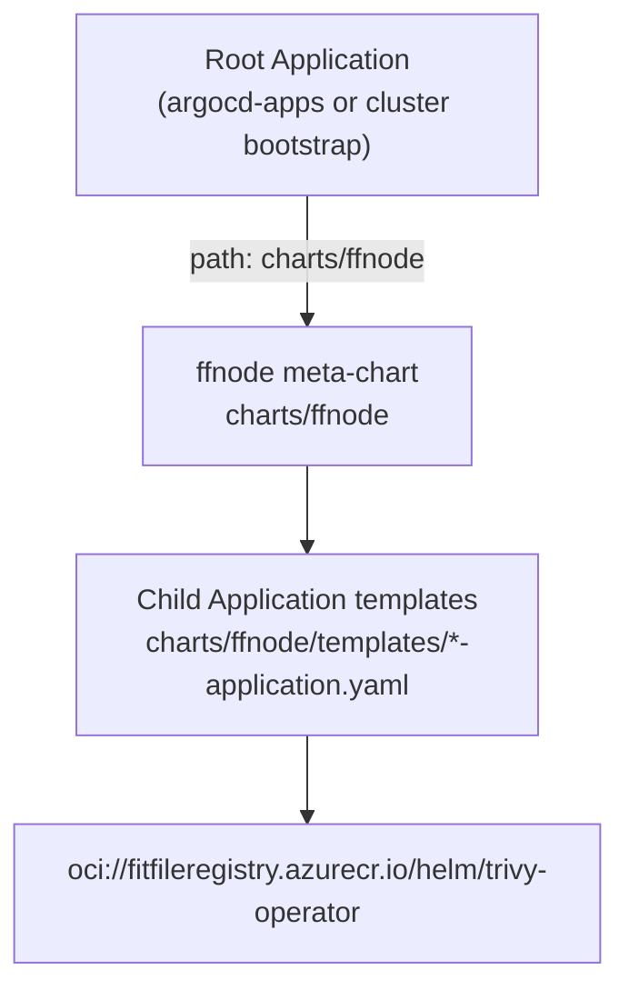

## Trivy Operator ArgoCD GitOps Audit

### Current Deployment State

| Finding                      | Detail                                                                                                                  |
| ---------------------------- | ----------------------------------------------------------------------------------------------------------------------- |
| deployment repo (ArgoCD) | No `trivy-operator` child Application existed prior to this work                                                        |
| rust-chart-manager       | Entry existed in `config.yaml` but was misconfigured (`terraform` / `fitfilepublic`)                                    |
| Live clusters            | Audit JSONs showed `trivy-system` pods on `mirror.gcr.io/aquasec/trivy-operator` (Terraform-managed, non-ACR-compliant) |
| `metricsVulnIdEnabled`   | Absent from deployment repo; upstream chart default is `false` at `operator.metricsVulnIdEnabled`                       |
| Trivy CLI only           | `scripts/patching.sh` and `scripts/old_import_chart_to_acr.sh`—ad-hoc image scans only                                |

#### Helm Values Key

Per-CVE metrics are enabled via `operator.metricsVulnIdEnabled: true` (under the `operator:` block in the upstream chart). When passed through ffnode, this becomes `trivyOperator.operator.metricsVulnIdEnabled: true`.

---

### App of Apps File Paths



| Layer | Path | Role |
|-------|------|------|
| Root App (local dev) | `charts/local-dev/argocd-apps-values.yaml` | Deploys Application `fitfile` → `charts/ffnode` |
| Meta-chart | `charts/ffnode/` | Renders child `Application` CRs |
| New child template | `charts/ffnode/templates/trivy-operator-application.yaml` | References ACR chart |
| Per-cluster overrides | `ffnodes/<org>/<cluster>/values.yaml` | Toggle `deploy.trivyOperator` |

Gating: `deploy.initialiseCluster` + `deploy.trivyOperator`

Sync wave: `-4` (with monitoring; after cert-manager/prometheus-crds at `-5`)

---

### Phase 1—rust-chart-manager (completed)

All chart and image mirroring to ACR goes through [[rust-chart-manager]]. Manual `helm pull` / `helm push` must not be used.

#### Pipeline Flow

1. Loader: `config.yaml` → `Ledger`
2. Gatekeeper: version assessment (Synced / Outdated / Missing)
3. Fetcher: `helm pull` to `local_path`
4. Analyzer: `helm template` → discover images
5. Importer: `az acr import` images to target ACR
6. Rewriter: set `gitops.images[].registry_path` → `fitfileregistry.azurecr.io`
7. Pusher: `helm package` → `oci://fitfileregistry.azurecr.io/helm/<chart>`

#### `config.yaml` Changes Applied

```yaml
- name: "trivy-operator"
  repo: "aquasecurity"
  local_path: "helm/trivy-operator"
  deployment_type: "argocd"
  gitops:
    upstream:
      chart: "trivy-operator"
      version: "0.33.2"
    images:
      - name: "operator"
        tag_path: "image.tag"
        repository_path: "image.repository"
        registry_path: "image.registry"
      - name: "trivy"
        tag_path: "trivy.image.tag"
        repository_path: "trivy.image.repository"
        registry_path: "trivy.image.registry"
      - name: "policies-bundle"
        tag_path: "policiesBundle.tag"
        repository_path: "policiesBundle.repository"
        registry_path: "policiesBundle.registry"
      - name: "node-collector"
        tag_path: "nodeCollector.tag"
        repository_path: "nodeCollector.repository"
        registry_path: "nodeCollector.registry"
```

Run internalisation:

```bash
cd rust-chart-manager
cargo run --bin internalise -- trivy-operator
```

#### ACR Validation (2026-06-22)

| Artifact | Repository | Tag | Status |
|----------|------------|-----|--------|
| Helm chart | `helm/trivy-operator` | `0.33.2` | ✅ Present |
| Operator image | `aquasec/trivy-operator` | `0.31.2` | ✅ Present (chart `appVersion`) |
| Trivy scanner | `aquasec/trivy` | `0.71.1` | ✅ Imported |
| Policies bundle | `aquasec/trivy-checks` | `1` | ✅ Imported |
| Node collector | `aquasecurity/node-collector` | `0.3.1` | ✅ Imported |

Local `helm/trivy-operator/values.yaml` has all four image registries rewritten to `fitfileregistry.azurecr.io`.

#### Known Gap

`internalise` only auto-imports images discovered by `helm template` (statically rendered manifests). Scan-job images (`trivy`, `trivy-checks`, `node-collector`) are referenced from values at runtime and were imported separately via `az acr import`. Recommendation: extend chart-manager to import images declared in `gitops.images`, not only rendered manifests.

---

### Phase 2—App of Apps (deployment Repo, completed)

#### New Template

`charts/ffnode/templates/trivy-operator-application.yaml`

- Gated on `deploy.initialiseCluster` + `deploy.trivyOperator`
- Sources `oci://fitfileregistry.azurecr.io/helm/trivy-operator` at `0.33.2`
- Deploys to `trivy-system`, sync-wave `-4`

#### Base Values (`charts/ffnode/values.yaml`)

```yaml
deploy:
  trivyOperator: true

trivyOperator:
  chart:
    targetRevision: "0.33.2"
  operator:
    metricsFindingsEnabled: true
    metricsVulnIdEnabled: true
  serviceMonitor:
    enabled: true
  trivy:
    ignoreUnfixed: true
```

#### Target ArgoCD Child Application (rendered reference)

```yaml
apiVersion: argoproj.io/v1alpha1
kind: Application
metadata:
  name: trivy-operator
  namespace: argocd
  annotations:
    argocd.argoproj.io/sync-wave: "-4"
  finalizers:
    - resources-finalizer.argocd.argoproj.io
spec:
  destination:
    namespace: trivy-system
    server: https://kubernetes.default.svc
  project: default
  revisionHistoryLimit: 3
  source:
    chart: helm/trivy-operator
    repoURL: fitfileregistry.azurecr.io
    targetRevision: "0.33.2"
    helm:
      releaseName: trivy-operator
      values: |
        operator:
          metricsFindingsEnabled: true
          metricsVulnIdEnabled: true
        serviceMonitor:
          enabled: true
        trivy:
          ignoreUnfixed: true
  syncPolicy:
    automated:
      prune: true
      selfHeal: true
      allowEmpty: false
    syncOptions:
      - Validate=false
      - CreateNamespace=true
      - PrunePropagationPolicy=foreground
      - PruneLast=true
    retry:
      limit: 5
      backoff:
        duration: 5s
        factor: 2
        maxDuration: 3m
```

---

### Operational Notes

- Cardinality: `metricsVulnIdEnabled: true` emits one `trivy_vulnerability_id` series per CVE occurrence—confirm Prometheus can handle the increase.
- Private registry scanning: Configure `operator.privateRegistryScanSecretsNames` for ACR image scans.
- Version alignment: `gitops.upstream.version`, ffnode `targetRevision`, and ACR chart tag must all match (`0.33.2`).
- Migration: Decommission Terraform-managed trivy-operator after ArgoCD takes ownership to avoid duplicate operators in `trivy-system`.
- Per-cluster disable:

```yaml
deploy:
  trivyOperator: false
```

#### Validation

```bash
./scripts/argo-render/argo-render -values ffnodes/<org>/<cluster>/values.yaml
```